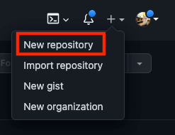
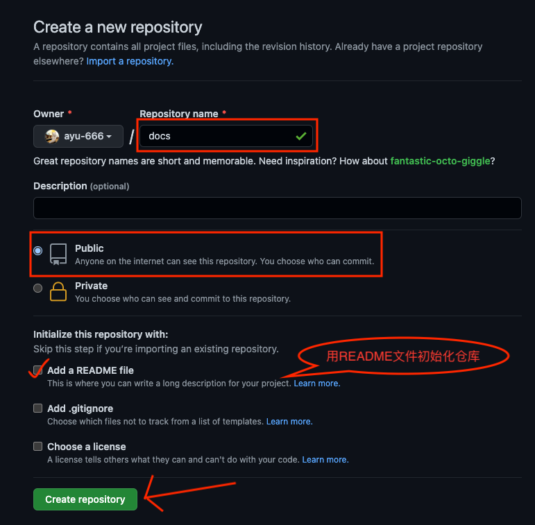
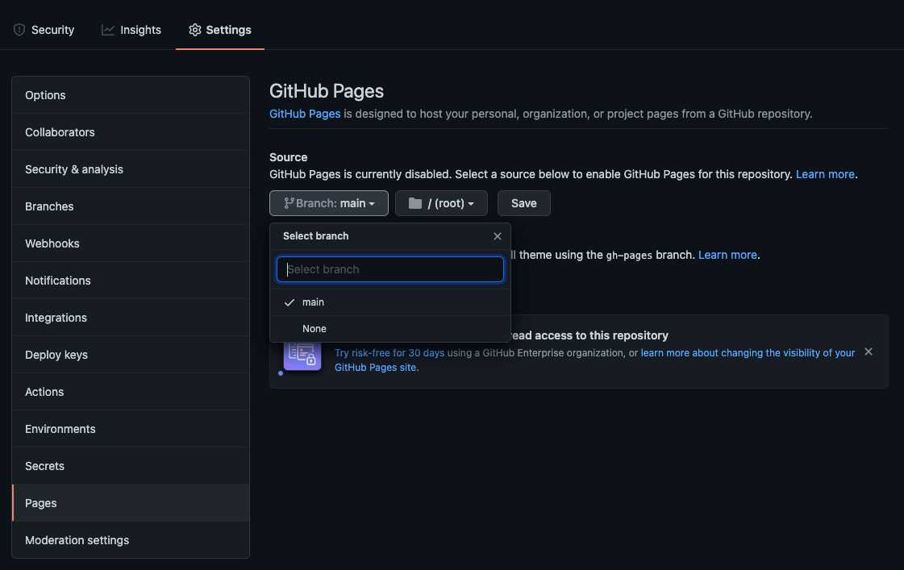

# 快速上手

[官方文档(中文)](https://docsify.js.org/#/zh-cn/)

## 简单几步完成初始化

### step1 根据示例创建文件

```
├── index.html
├── README.md
```

### step2 将内容复制到index.html
> 需要关注的只有`window.$docsify`, 常用配置项都有注释
```html
<!DOCTYPE html>
<html>
<head>
    <meta http-equiv="X-UA-Compatible" content="IE=edge,chrome=1">
    <meta name="viewport" content="width=device-width,initial-scale=1">
    <meta charset="UTF-8">
    <!--  主题  -->
    <!--    <link rel="stylesheet" href="https://unpkg.com/docsify/themes/vue.css">-->
    <link rel="stylesheet" href="https://cdn.jsdelivr.net/npm/docsify-themeable@0/dist/css/theme-simple.css">
    <!--    <link rel="stylesheet" href="https://cdn.jsdelivr.net/npm/docsify-themeable@0/dist/css/theme-simple-dark.css">-->
    <!--    <link rel="stylesheet" href="https://unpkg.com/docsify/themes/dark.css">-->
</head>

<body>

<div id="app">加载中<!--加载中提示文本(可留空)--></div>

<script>
    window.$docsify = {
        name: 'demo',//侧边栏顶部文档标题
        nameLink: '/',//点击标题后跳转链接
        repo: 'username/repository',//配置仓库后右上角会渲染一个github挂件
        auto2top: true,//切换页面后是否自动跳转到页面顶部
        homepage: 'README.md',//主页
        logo: '/_media/icon.svg',//侧边栏网站图标，可用css调整大小
        formatUpdated: '{YYYY}/{MM}/{DD} {HH}:{mm}:{ss}',//显示md文档更新日期，格式参考https://github.com/lukeed/tinydate#patterns
        search: {//搜索插件配置
            maxAge: 86400000,// 索引过期时间，单位毫秒，默认一天
            paths: 'auto',
            placeholder: '搜索',
            noData: '找不到结果',
            depth: 3,// 搜索标题的最大层级, 1 - 6
            hideOtherSidebarContent: false, // 是否隐藏其他侧边栏内容
        },
    }
</script>

<!-- docsify -->
<script src="https://cdn.jsdelivr.net/npm/docsify/lib/docsify.min.js"></script>
<!-- 全文搜索插件 -->
<script src="//cdn.jsdelivr.net/npm/docsify/lib/plugins/search.min.js"></script>
<!-- 图片缩放插件 -->
<script src="//cdn.jsdelivr.net/npm/docsify/lib/plugins/zoom-image.min.js"></script>
<!-- 复制到剪切板插件 -->
<script src="//cdn.jsdelivr.net/npm/docsify-copy-code/dist/docsify-copy-code.min.js"></script>
<!--  更多插件查看https://docsify.js.org/#/zh-cn/plugins  -->

</body>
</html>
```

### step3 将内容复制到README.md

```markdown
# Hello

hello world
```

## 访问项目

### 方法一、docsify-cli工具🔧

执行命令`npm i docsify-cli -g`或者`yarn global add docsify-cli`安装cli工具

使用docsify启动服务

```bash
docsify serve ./
# 服务将监听在3000端口
```

> 使用docsify-cli运行的好处是修改内容后无需刷新网页即可看得到变化

### 方法二、python静态服务🌍

进入文档目录，执行python命令

```bash
python -m SimpleHTTPServer
# 服务将监听在8000端口
```


# 文章分类-侧边栏分组
## 手动配置
### 配置文件添加loadSidebar选项
```js
window.$docsify = {
    loadSidebar: true,//加载自定义侧边栏
}
```
### 在根目录创建`_sidebar.md`和`.nojekyll`文件
> `.nojekyll`文件用于防止部署github page后404


__`_sidebar.md`内容示例__

```markdown
* docsify
  * [快速上手](docsify/快速上手)
  * [文章分类](docsify/文章分类)
* 数据库安全
  * [宽字节注入](数据库安全/宽字节注入)
```

## js脚本自动配置
将代码复制到项目根目录`generate-sidebar.js`

执行`node ./generate-sidebar.js`即可自动更新侧边栏配置文件`_sidebar.md`

> 可将命令配置到自己的`push.sh`或`push.bat`，推送到github时更新目录
```js
const fs = require('fs');
const blacklist = ['_sidebar.md', 'img', "CNAME"]
function getContent(_path,_dir="/",tab){
    let md = ""
    let files = ((fs.readdirSync(_path)).filter(item=>(blacklist.indexOf(item)<0 && !/^\.+.*/.test(item)))).sort((a, b) => {return a - b})
    if (_dir) {md = tab+"* "+_dir+"\n";tab+="  "}
    for (const i in files) {
        let item = files[i]
        let fullpath =_path+"/"+item
        let title = getTitle(fullpath,item)
        if(fs.lstatSync(fullpath).isDirectory()){
            md += getContent(fullpath,item,tab)
        }else if (/.*\.md$/.test(item)){
            md += tab+"* ["+title+"]("+((_path.replace(__dirname,"")+"/"+item).replace(/\s/g,"%20"))+")\n"
        }
    }
    return md
}
function getTitle(path,md) {
    let title = md.substr(0,md.length-3)
    if (md.toLowerCase()=="readme.md"){
        title =  "README"
    }else if (md.indexOf('.md')<1) {
        title = md
    }else {
        let data = fs.readFileSync(path, 'utf8').split("\n")
        for (const i in data) {if(/^(\s*#){1}\s+.*/.test(data[i])) return data[i].replace(/^(\s*#){1}\s+/,"")}
    }
    return title
}
const md = getContent(__dirname,"","")
fs.writeFile(__dirname+'/_sidebar.md', md, { encoding: 'utf8' }, err => {  });
console.log("\n目录:\n",md)
```


# 编译静态文件优化搜索排名-docsify编译工具

> [docsify官网](https://docsify.js.org/#/zh-cn/)
>
> [docsify简易入门](https://blog.duokan.xyz/docsify文档网站生成器/快速上手)
>
> [工具源码仓库](https://github.com/ayu-666/docsify-build)

将docsify文档每个页面编译成独立的html文件

## 安装

```bash
npm i docsify-build -g
```

or

```bash
yarn global add docsify-build
```

## 使用

```bash
docsify-build -d ./docs -o ./dist
```

## 参数列表

```
--o 输出路径 默认 ./dist
--d 文档路径 默认 ./
--t html模版路径
--c 配置文件路径
```

## 配置文件示例

```js
module.exports =  {
    name: 'name',
    repo: 'github/repository',
    routerMode: 'history',
    loadSidebar: true,
    auto2top: true
}
```
## 模版示例

```html
<!DOCTYPE html>
<html lang="en">
<head>
    <meta charset="UTF-8">
    <link rel="icon" href="https://docsify.js.org/_media/favicon.ico">
    <meta http-equiv="X-UA-Compatible" content="IE=edge,chrome=1"/>
    <meta name="viewport" content="width=device-width, initial-scale=1.0, minimum-scale=1.0">
    <link rel="stylesheet" href="https://unpkg.com/docsify/themes/vue.css">
    <link rel="stylesheet" href="https://unpkg.com/docsify-toc@1.0.0/dist/toc.css">
</head>
<body>
<!--inject-app-->
<!--inject-config-->
</body>
<script src="//cdn.jsdelivr.net/npm/docsify@4"></script>
<script src="//cdn.jsdelivr.net/npm/docsify-copy-code"></script>
<script src="/search.js"></script>
<script src="//cdn.jsdelivr.net/npm/docsify/lib/plugins/zoom-image.min.js"></script>
<script src="//cdn.jsdelivr.net/npm/docsify/lib/plugins/emoji.min.js"></script>
<script src="//unpkg.com/docsify-toc@1.0.0/dist/toc.js"></script>
<script src="//unpkg.com/docsify-count/dist/countable.js"></script>
<script src="https://cdn.jsdelivr.net/npm/prismjs@1/components/prism-python.min.js"></script>
<script src="//cdn.jsdelivr.net/npm/prismjs@1/components/prism-bash.min.js"></script>
<script src="//cdn.jsdelivr.net/npm/prismjs@1/components/prism-php.min.js"></script>
<script src="//cdn.jsdelivr.net/npm/docsify-pagination/dist/docsify-pagination.min.js"></script>
</html>
<script>
    // 让每次点击都跳转(不推荐)
    // window.history.pushState = function (a,b,c){
    //     window.location.href=c
    // }
</script>
```

# 部署github page
## 创建公共仓库

1. 点击github右上角加号里的`New repository`



2. 编辑仓库名称并确定仓库权限为`Public`，然后点击`绿色按钮`即可完成仓库创建



## 配置静态页面链接

1. 进入仓库页面，依次点击`Setting`-`Pages`

2. `source`选项选择`main`分支后点击`Save`



> 访问链接为 https://你的用户名.github.io/仓库名/

## 推送文档到github
1. 执行命令

```bash
# 在当前文件夹初始化仓库
git init
# 将当前目录所有文件添加到暂存区(暂存待操作区)
git add .

# 为暂存区内的文件创建一个版本，引号内为git日志，请自行修改
git commit -m ""

# 将最新版本推送到github远程仓库
git push -f git@github.com:你的用户名/仓库名.git master:main
```

## github page配置自定义域名的坑(选读)

每次`git push`推送新文件，github上的配置项`Setting`-`Pages`-`Custom domain`都会被重置

__解决方法__

在项目根目录创建`CNAME`文件, 并将你的自定义域名放在第一行

如:

```CNAME
note.duokan.xyz
```

