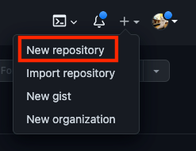
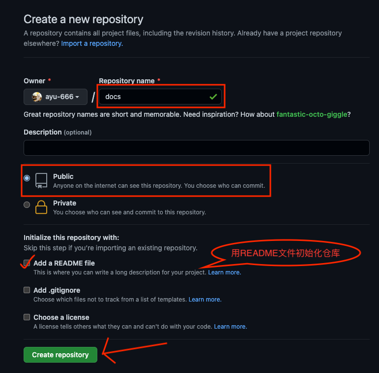
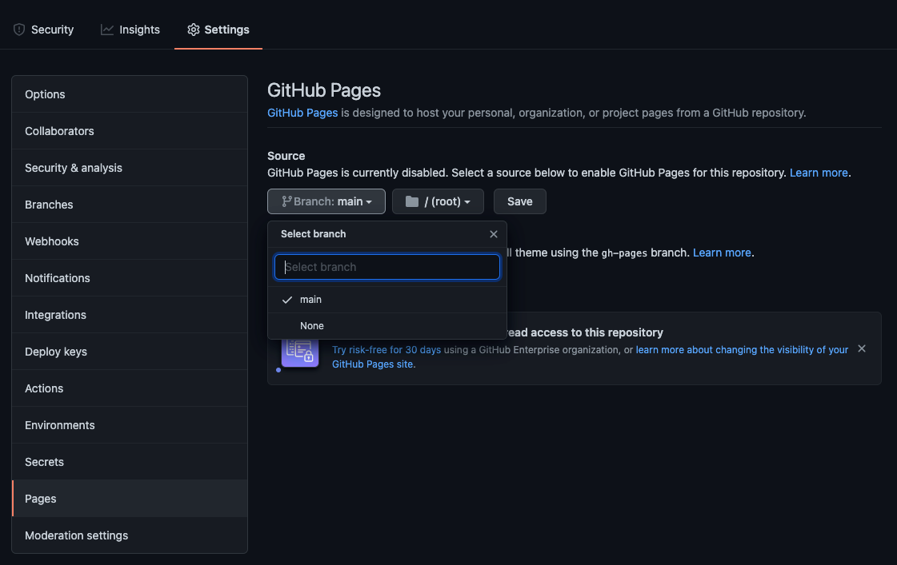

# 部署github page
## 创建公共仓库

1. 点击github右上角加号里的`New repository`



2. 编辑仓库名称并确定仓库权限为`Public`，然后点击`绿色按钮`即可完成仓库创建



## 配置静态页面链接

1. 进入仓库页面，依次点击`Setting`-`Pages`

2. `source`选项选择`main`分支后点击`Save`



> 访问链接为 https://你的用户名.github.io/仓库名/

## 推送文档到github
1. 执行命令

```bash
# 在当前文件夹初始化仓库
git init
# 将当前目录所有文件添加到暂存区(暂存待操作区)
git add .

# 为暂存区内的文件创建一个版本，引号内为git日志，请自行修改
git commit -m ""

# 将最新版本推送到github远程仓库
git push -f git@github.com:你的用户名/仓库名.git master:main
```

## github page配置自定义域名的坑(选读)

每次`git push`推送新文件，github上的配置项`Setting`-`Pages`-`Custom domain`都会被重置

__解决方法__

在项目根目录创建`CNAME`文件, 并将你的自定义域名放在第一行

如:

```CNAME
note.duokan.xyz
```