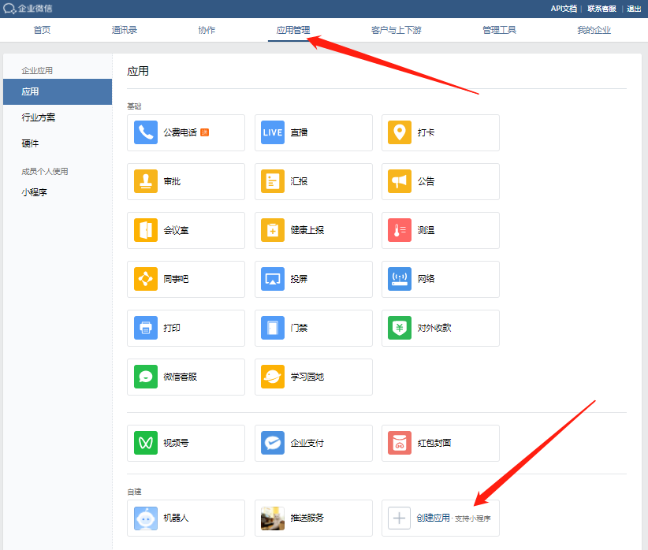

# 企业微信应用推送通知所需参数获取教程

> 使用企业微信推送消息给个人微信需要获取的参数有
> - AgentId
> - Secret
> - 企业ID

企业微信电脑网页端站点：https://work.weixin.qq.com

### 创建应用

- 导航栏-应用管理-创建应用

- 填写应用名称，设置头像，提交表单

### 获取应用的AgentId、Secret

- 导航栏-应用管理-打开刚才创建的应用,获取AgentId与Secret

### 获取企业的ID

- 导航栏-我的企业，拖动到底部，获取企业ID

### 将企业微信添加到个人微信

- 导航栏-我的企业-微信插件，拖动到底部，使用个人微信扫码

