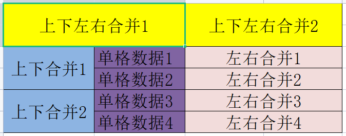
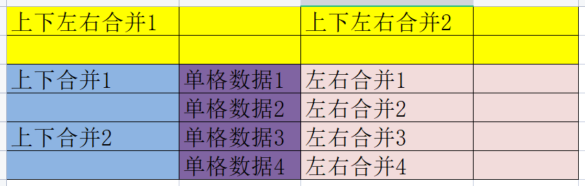
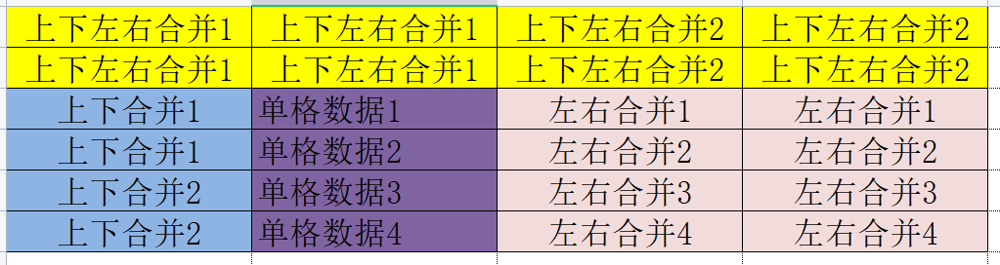

# go读取excel合并单元格

> 日期: 2022/12/29


> 
> 
> 
> 合并单元格的子单元格存在大量空值
> 
> 使用编程语言按 [行号-列号] 直接读取会读取到错误的数据。
> 
> 
> 
> 解决方法是，读取第一个子单元格的值，并赋值所有子单元格。
> 


```go
import (
	"github.com/tealeg/xlsx"
)


func main() {
	excelFile, err := xlsx.OpenFile("t.xlsx")
	if err != nil {
		panic(err)
	}
	for _, sheet := range excelFile.Sheets {
		for rowIndex, row := range sheet.Rows {
			for cellIndex, cell := range row.Cells {
				for VMI := 0; VMI <= cell.VMerge; VMI++ {
					sheet.Rows[rowIndex+VMI].Cells[cellIndex].SetValue(cell.String())
					for HMI := 0; HMI <= cell.HMerge; HMI++ {
						sheet.Rows[rowIndex+VMI].Cells[cellIndex+HMI].SetValue(cell.String())
					}
				}
				if cell.VMerge+cell.HMerge > 0 {
					cell.Merge(0, 0)
				}
			}
		}
	}
	excelFile.Save("2.xlsx")
}
```
处理结果

