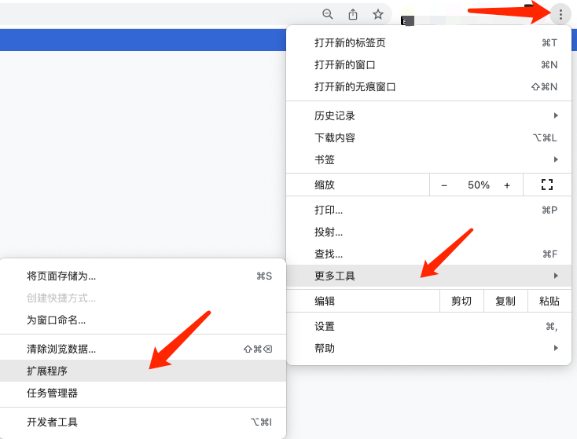
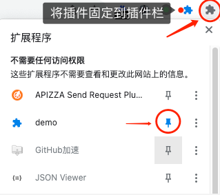
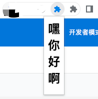

# 快速开始

> 日期：2022/02/01 11:47 

新年快乐！写点小东西助助兴～

> [官方文档: https://developer.chrome.com/docs/extensions/mv3/](https://developer.chrome.com/docs/extensions/mv3/)

## 简单三步创建插件项目

- 根据示例创建文件
```
├── manifest.json
├── popup.html
```
- 编辑manifest.json
```json
{
  "manifest_version": 3,//插件引擎版本
  "version": "1.0.0",//插件版本
  "name": "demo",//插件名称
  "homepage_url": "https://www.xxx.com/",//插件官网
  "description": "一个简单的chrome插件",//插件描述
  "action": {
    "default_icon": "icon.png",//插件图标
    "default_title": "你好我是标题，喂信转账散百",//鼠标悬浮插件图标上时显示的标题
    "default_popup": "popup.html"//点击插件图标的弹窗页
  }
}
```

- 编辑popup.html

```html
<meta charset="UTF-8">
<h1>嘿你好啊</h1>
```


## 导入插件

- 点击chrome右上角菜单按钮进入扩展程序管理页面

  

- 点击右上角开启`开发者模式`

- 点击`加载已解压的扩展程序`并选择项目路径

- 将插件图标固定到插件栏
  
  

## 查看效果

- 点击插件图标查看效果

  

!> 弹出页尺寸最大支持：宽800px、高600px

