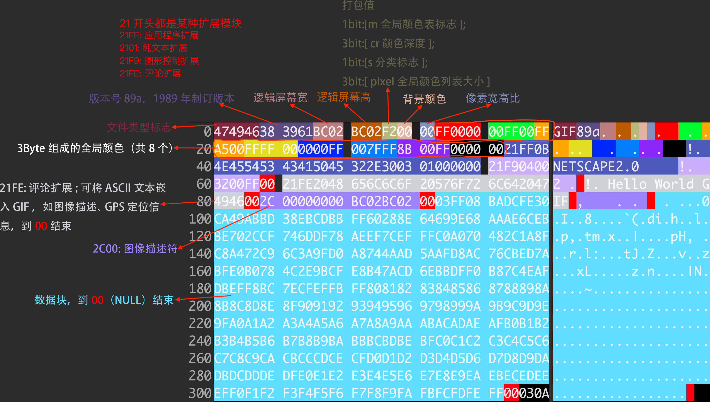

# gif文件存储结构

文档: http://giflib.sourceforge.net/whatsinagif/bits_and_bytes.html

不考虑二次渲染的情况下做隐写，可参考以下建议

- 可插入文本的区块有`21FE--00`、`2101--00` 
- 将数据插入到`00`前一位，对文件影响较小。
- 也可找到任意一处结尾`00`，紧跟其后手动创建一个`评论扩展`区块`21FE--00`，再将代码片段放入自己创建的区块中
