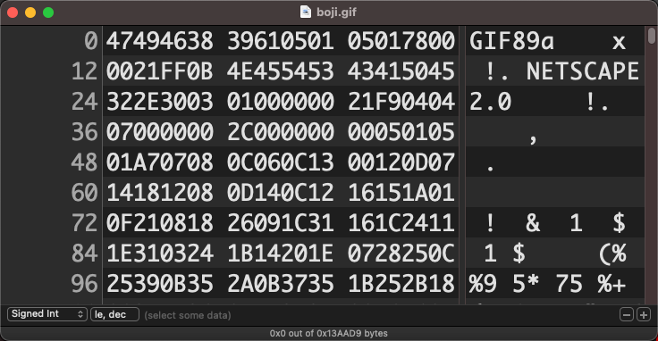
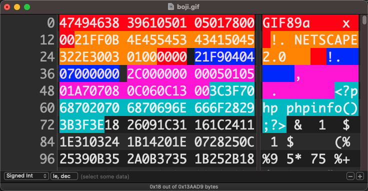

# 制作图片马

## jpg追加法

准备图片素材与一句话木马

`1.jpg` `1.gif` `hack.php`

### linux

```bash
cat 1.jpg hack.php > hack.jpg
```

### windows

参数b(指binary)

若只是普通文本文件合并，也可使用参数a(指ASCII)

```bash
copy/b 1.jpg + hack.php hack.jpg 
```

- 同样方法也可将多个m3u8视频拼接转换成mp4
- 拼接多个mp3可连续播放多条音频

## gif隐写(推荐)

### 简介

gif文件中定义了很多种信息块的格式，头部包含最多关键信息，如全局颜色表、画面比例等，受服务器二次渲染影响比较小

仅替换头部信息，可降低二次渲染后内容被重置的概率

### 工具准备

- [HexFiend(mac)](https://github.com/HexFiend/HexFiend/releases/tag/v2.14.1)
- [EverEdit(windows)](http://cn.everedit.net/)
- [winHex(windows)](http://www.x-ways.net/winhex/)
- [字符串hex互转在线工具](https://tool.lu/hexstr/)

#### linux/mac可直接使用vim+xdd

执行命令：`vim -b 1.gif` 参数`-b`(打开一个binary文件,不指定参数会在后面出现一个换行符`0x0a`)

然后在vim命令模式下调用系统xxd转换命令：`:%!xxd`

!> vim中只能通过修改hex来改变值，不要修改地址和后面的ascii码，**且保存前要记得输入`:%!xxd -r`转回ascii模式**

> 只是查看hex的话，可在shell中使用xxd命令 `xxd 1.gif | less`

### 动手试一试吧

> **本次测试使用的图片**
> 
> 

- 使用编辑工具打开gif图片



- 避开前13个字节
- 避开`21FF___00`，这是应用程序扩展
- 避开`21F9___00`，这是图形控制扩展
- 避开`2C00000000___00`，这是图像描述符
- [点击查看gif文件存储结构](/其他/gif文件存储结构)


- 尝试替换部分内容（是替换不是新增）

- 测试图片是否可打开



- 将图片上传到目标站点，下载响应过来的图片，查看数据是否被二次渲染破坏

> 当一处长度不足以输入所有代码时，灵活应用注释在多处拼接代码
